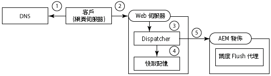
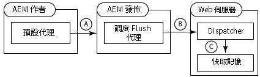
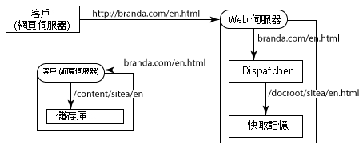
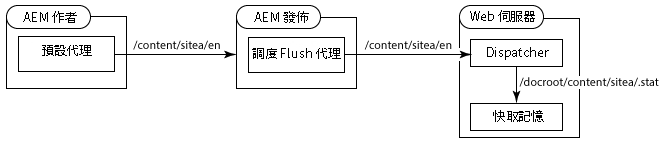
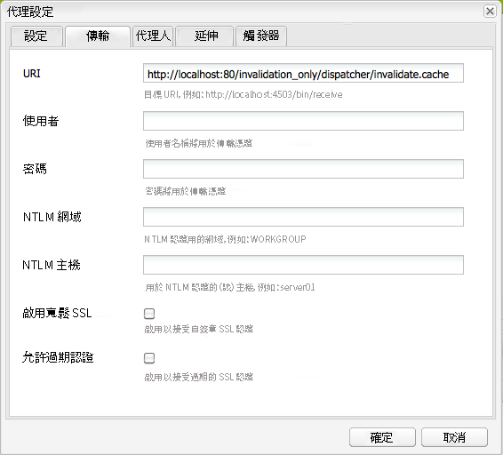
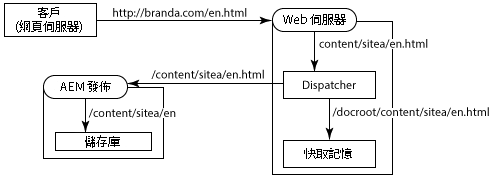
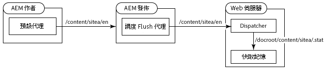
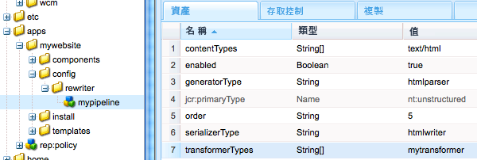

# 搭配多個網域使用Dispatcher {#using-dispatcher-with-multiple-domains}

>[!NOTE]
>
>Dispatcher版本與AEM獨立。如果您關注Dispatcher文件中內嵌於AEM或CQ文件的Dispatcher文件，可能會重新導向至此頁面。

使用Dispatcher處理多個網頁的頁面請求，同時支援下列條件：

* 這兩個網域的網頁內容都會儲存在單一AEM存放庫中。
* Dispatcher快取中的檔案可分別為每個網域而失效。

例如，公司的兩個品牌publi網站：品牌A和品牌B。網站頁面的內容是以AEM編寫，並儲存在相同的存放庫工作區中：

```
/
| - content  
   | - sitea  
       | - content nodes  
   | - siteb  
       | - content nodes
```

儲存 `BrandA.com` 的頁面 `/content/sitea`如下。會傳回節點的用戶端 `https://BrandA.com/en.html` 請求，傳回 `/content/sitea/en` 節點的轉譯頁面。同樣地，下列 `BrandB.com` 儲存頁面 `/content/siteb`。

使用Dispatcher快取內容時，必須在用戶端HTTP請求中的頁面URL、快取中對應檔案的路徑，以及存放庫中對應檔案的路徑之間建立關聯。

## 用戶端要求

當客戶傳送HTTP要求至Web伺服器時，要求頁面的URL必須解析為Dispatcher快取中的內容，最後才會解決存放庫中的內容。



1. 網域名稱系統會揭開Web伺服器的IP位址，並在HTTP要求中註冊為網域名稱。
1. HTTP要求會傳送至Web伺服器。
1. HTTP要求會傳送至Dispatcher。
1. Dispatcher會判斷快取檔案是否有效。如果有效，則會提供快取的檔案給用戶端。
1. 如果快取檔案無效，Dispatcher會從AEM發佈例項要求新轉譯頁面。

## 快取失效

當Dispatcher刷新的Replication Agent要求要求Dispatcher失效快取檔案時，存放庫中內容的路徑必須解析為快取中的內容。



1. 頁面會在AEM作者實例上啓動，內容會複製到發佈例項。
1. Dispatcher Upfling Agent會呼叫Dispatcher使複製內容的快取失效。
1. Dispatcher會接觸一或多個. stat檔案，使快取的檔案失效。

若要使用Dispatcher與多個網域，您必須設定AEM、Dispatcher和您的Web伺服器。本頁所述的解決方案是一般的，適用於大多數環境。由於某些AEM拓撲的複雜性，您的解決方案需要進一步自訂組態來解決特定問題。您可能需要調整範例以滿足現有的IT基礎結構和管理政策。

## URL對應 {#url-mapping}

若要啓用網域URL和內容路徑以解析至快取檔案，必須翻譯檔案路徑或頁面URL。提供下列常見策略的說明，其中路徑或URL翻譯發生在程序的不同點：

* (建議) AEM發佈例項使用Sling對應來實施資源解析度，以實施內部URL重寫規則。網域URL會翻譯成內容存放庫路徑。(請參閱 [AEM重新寫入傳入的URL](dispatcher-domains.md#main-pars-title-2))。
* Web伺服器使用內部URL重寫規則，將網域URL翻譯為快取路徑。(請參閱 [「Web伺服器重新寫入傳入URL](dispatcher-domains.md#main-pars-title-1)」)。

通常需要使用簡短的網頁URL。通常頁面URL會反映包含網頁內容之儲存庫檔案夾的結構。However, the URLs do not reveal the topmost repository nodes, such as `/content`. 用戶端不一定知道AEM存放庫的結構。

## 一般需求 {#general-requirements}

您的環境必須實作下列組態，以支援與多個網域搭配使用的Dispatcher：

* 每個網域的內容位於存放庫的個別分支中(請參閱下面的範例環境)。
* AEM發佈例項上已設定Dispatcher刷新復本。(請參閱 [「發佈例項中的無效Dispatcher快取](page-invalidate.md)」)。
* 網域名稱系統可解析網站伺服器的IP位址。
* Dispatcher快取反映AEM內容存放庫的目錄結構。Web伺服器文件根目錄下方的檔案路徑與存放庫中的檔案路徑相同。

## 提供範例的環境 {#environment-for-the-provided-examples}

提供的範例解決方案適用於具有下列特性的環境：

* AEM作者和發佈例項部署在Linux系統上。
* Apache HTTPD是網頁伺服器，部署在Linux系統上。
* AEM內容存放庫和網頁伺服器的文件根目錄使用下列檔案結構(Apache網頁伺服器的文件根目錄為/`usr/lib/apache/httpd-2.4.3/htdocs)`：

   **存放庫**

```
  | - /content  
    | - sitea  
  |    | - content nodes 
    | - siteb  
       | - conent nodes
```

**網頁伺服器的文件根目錄**

```
  | - /usr  
    | - lib  
      | - apache  
        | - httpd-2.4.3  
          | - htdocs  
            | - content  
              | - sitea  
                 | - content nodes 
              | - siteb  
                 | - content nodes
```

## AEM重寫傳入URL {#aem-rewrites-incoming-urls}

資源解析度的Sling對應可讓您將傳入的URL與AEM內容路徑產生關聯。在AEM發佈例項上建立映射，以便從Dispatcher將演算請求解析為存放庫中的正確內容。

Dispatcher的頁面演算請求會使用從網站伺服器傳遞的URL來識別頁面。當URL包含網域名稱時，Sling mapping會解析內容的URL。下圖說明對應至節點 `branda.com/en.html` 的URL `/content/sitea/en` 。



Dispatcher快取會反映儲存庫節點結構。因此，若頁面啓動發生導致快取頁面無效的請求，則不需要URL或路徑轉換。



## 定義Web伺服器上的虛擬主機 {#define-virtual-hosts-on-the-web-server}

定義Web伺服器上的虛擬主機，以便將不同的文件根目錄指派給每個網頁網域：

* Web伺服器必須為每個網域定義虛擬網域。
* 對於每個網域，請設定文件根目錄與存放庫中包含網域內容內容的資料夾相符。
* 如 [安裝Dispatcher](dispatcher-install.md) 頁面所述，每個虛擬網域也必須包含Dispatcher相關組態。

下列範例 `httpd.conf` 檔案為Apache網頁伺服器設定兩個虛擬網域：

* 伺服器名稱(與網域名稱相符)是branda.com(第16行)和brandb.com(第30行)。
* 每個虛擬網域的文件根目錄為Dispatcher快取中包含網站頁面的目錄。(line17和31)

透過此設定，Web伺服器會在收到下列要求時執行下列動作 `https://branda.com/en/products.html`：

* 將URL與 `ServerName` 具有 `branda.com.`

* 將URL轉寄給Dispatcher。

### httpd. conf {#httpd-conf}

```xml
# load the Dispatcher module
LoadModule dispatcher_module modules/mod_dispatcher.so
# configure the Dispatcher module
<IfModule disp_apache2.c>
 DispatcherConfig conf/dispatcher.any
 DispatcherLog    logs/dispatcher.log  
 DispatcherLogLevel 3
 DispatcherNoServerHeader 0 
 DispatcherDeclineRoot 0
 DispatcherUseProcessedURL 0
 DispatcherPassError 0
</IfModule>

# Define virtual host for brandA.com
<VirtualHost *:80>
  ServerName branda.com
  DocumentRoot /usr/lib/apache/httpd-2.4.3/htdocs/content/sitea
   <Directory /usr/lib/apache/httpd-2.4.3/htdocs/content/sitea>
     <IfModule disp_apache2.c>
       SetHandler dispatcher-handler
       ModMimeUsePathInfo On
     </IfModule>
     Options FollowSymLinks
     AllowOverride None
   </Directory>
</VirtualHost>

# define virtual host for brandB.com
<VirtualHost *:80>
  ServerName brandB.com
  DocumentRoot /usr/lib/apache/httpd-2.4.3/htdocs/content/siteb
   <Directory /usr/lib/apache/httpd-2.4.3/htdocs/content/siteb>
     <IfModule disp_apache2.c>
       SetHandler dispatcher-handler
       ModMimeUsePathInfo On
     </IfModule>
     Options FollowSymLinks
     AllowOverride None
   </Directory>
</VirtualHost>

# document root for web server
DocumentRoot "/usr/lib/apache/httpd-2.4.3/htdocs"
```

請注意，虛擬主機繼承 [在主要伺服器區段中設定的DispatchCerConfig](dispatcher-install.md#main-pars-67-table-7) 屬性值。虛擬主機可包含自己的DispatchConfig屬性，以覆寫主要伺服器組態。

### 設定Dispatcher以處理多個網域 {#configure-dispatcher-to-handle-multiple-domains}

若要支援包含網域名稱及其對應虛擬主機的URL，請定義下列Dispatcher農場：

* 為每個虛擬主機設定Dispatcher農場。這些農場會處理每個網域的網頁伺服器要求、檢查快取檔案，並從轉譯請求頁面。
* 設定Dispatcher農場，用於將快取內容無效，不論內容屬於哪個網域。此農場處理來自刷新Dispatcher複製代理程式的檔案失效請求。

### 為虛擬主機建立Dispatcher農場

虛擬主機的農場必須具有下列組態，以便用戶端HTTP請求中的URL可解決Dispatcher快取中的正確檔案：

* `/virtualhosts` 屬性會設為網域名稱。此屬性可讓Dispatcher將農場與網域建立關聯。
* `/filter` 此屬性可讓您存取請求URL在網域名稱部分之後被截斷的路徑。例如，對於 `https://branda.com/en.html` URL，路徑會解讀為 `/en.html`，因此篩選器必須允許存取此路徑。

* `/docroot` 屬性會設為dispatcher快取中網域網站內容根目錄的路徑。此路徑會作為原始請求之串連URL的首碼。例如，請求的docroot `/usr/lib/apache/httpd-2.4.3/htdocs/sitea` 會將要求 `https://branda.com/en.html` 解析為 `/usr/lib/apache/httpd-2.4.3/htdocs/sitea/en.html` 檔案。

此外，必須將AEM發佈例項指定為虛擬主機的演算。視需要設定其他農場屬性。下列程式碼為branda.com網域的縮寫農場設定：

```xml
/farm_sitea  {     
    ...
    /virtualhosts { "branda.com" }
    /renders {
      /rend01  { /hostname "127.0.0.1"  /port "4503" }
    }
    /filter {
      /0001 { /type "deny"  /glob "*" }
      /0023 { /type "allow" /glob "*/en*" }  
      ...
     }
    /cache {
      /docroot "/usr/lib/apache/httpd-2.4.3/htdocs/content/sitea"
      ...
   }
   ...
}
```

### 建立用於快取失效的Dispatcher農場

處理快取快取檔案的要求時需要Dispatcher農場。此農場必須能夠存取每個虛擬主機的docroot目錄中的. stat檔案。

下列屬性配置可讓Dispatcher從快取中解析AEM內容存放庫中的檔案：

* `/docroot` 屬性會設為Web伺服器的預設docroot。通常，這是建立 `/content` 資料夾的目錄。Linux上Apache的範例值 `/usr/lib/apache/httpd-2.4.3/htdocs`為。
* `/filter` 該屬性允許存取 `/content` 目錄下方的檔案。

`/statfileslevel`屬性必須夠高，因此. stat檔案會在每個虛擬主機的根目錄中建立。此屬性可讓每個網域的快取分開失效。在設定範例中， `/statfileslevel``2` 在 `*docroot*/content/sitea` 目錄和 `*docroot*/content/siteb` 目錄中建立. stat檔案的值。

此外，必須將發佈例項指定為虛擬主機的演算。視需要設定其他農場屬性。下列程式碼是用於將快取失效的農場縮寫設定：

```xml
/farm_flush {  
    ...
    /virtualhosts   { "invalidation_only" }
    /renders  {
      /rend01  { /hostname "127.0.0.1" /port "4503" }
    }
    /filter   {
      /0001 { /type "deny"  /glob "*" }
      /0023 { /type "allow" /glob "*/content*" } 
      ...
      }
    /cache  {
       /docroot "/usr/lib/apache/httpd-2.4.3/htdocs"
       /statfileslevel "2"
       ...
   }
   ...
}
```

當您啓動Web伺服器時，Dispatcher記錄檔(在除錯模式中)表示所有農場的初始化：

```shell
Dispatcher initializing (build 4.1.2)
[Fri Nov 02 16:27:18 2012] [D] [24974(140006182991616)] farms[farm_sitea].cache.docroot = /usr/lib/apache/httpd-2.4.3/htdocs/content/sitea
[Fri Nov 02 16:27:18 2012] [D] [24974(140006182991616)] farms[farm_siteb].cache.docroot = /usr/lib/apache/httpd-2.4.3/htdocs/content/siteb
[Fri Nov 02 16:27:18 2012] [D] [24974(140006182991616)] farms[farm_flush].cache.docroot = /usr/lib/apache/httpd-2.4.3/htdocs
[Fri Nov 02 16:27:18 2012] [I] [24974(140006182991616)] Dispatcher initialized (build 4.1.2)
```

### 設定資源解析度的Sling對應 {#configure-sling-mapping-for-resource-resolution}

使用Sling對應來解決資源解析度，以便以網域為基礎的URL解決AEM發佈例項上的內容。資源對應可將接收的URL從Dispatcher(原始用戶端HTTP請求)轉換為內容節點。

若要瞭解Sling資源對應，請參閱 [Sling文件中的「對應資源解決方案](https://sling.apache.org/site/mappings-for-resource-resolution.html) 」。

通常，您需要映射才能進行下列資源，但需要額外對應：

* 內容頁面的根目錄(以下 `/content`)
* 頁面使用的設計節點(以下 `/etc/designs`)
* 資料 `/libs` 夾

建立內容頁面對應之後，若要發現其他必要對應，請使用網頁瀏覽器開啓網頁伺服器上的頁面。在發佈例項的error. log檔案中，找出找不到資源的訊息。下列範例訊息指出需要 `/etc/clientlibs` 對應：

```shell
01.11.2012 15:59:24.601 *INFO* [10.36.34.243 [1351799964599] GET /etc/clientlibs/foundation/jquery.js HTTP/1.1] org.apache.sling.engine.impl.SlingRequestProcessorImpl service: Resource /content/sitea/etc/clientlibs/foundation/jquery.js not found
```

>[!NOTE]
>
>預設Apache Sling重寫程式的linkchecker轉換器會自動修改頁面中的超連結，以防止中斷的連結。不過，連結重新寫入只會在連結目標為HTML或HTM檔案時執行。若要更新其他檔案類型的連結，請建立轉換器元件並將它新增至HTML重寫管線。

### 資源對應節點範例

下表列出實施branda.com網域資源對應的節點。會為 `brandb.com` 網域建立類似節點， `/etc/map/http/brandb.com`例如在所有情況下，當頁面HTML參照在Sling的內容中無法正確解析時，就需要對應。

| 節點路徑 | 類型 | 屬性 |
|--- |--- |--- |
| `/etc/map/http/branda.com` | sling：對應對應 | 名稱：sling：InternalRedirect Type：字串值：/content/sitea |
| `/etc/map/http/branda.com/libs` | sling：對應對應 | 名稱：sling：InternalRedirect <br/>Type：字串 <br/>值：/libs |
| `/etc/map/http/branda.com/etc` | sling：對應對應 |
| `/etc/map/http/branda.com/etc/designs` | sling：對應對應 | 名稱：sling：InternalRedirect <br/>VType：字串 <br/>VValue：/etc/designs |
| `/etc/map/http/branda.com/etc/clientlibs` | sling：對應對應 | 名稱：sling：InternalRedirect <br/>VType：字串 <br/>VValue：/etc/clientlibs |

## 設定Dispatcher刷新復本代理程式 {#configuring-the-dispatcher-flush-replication-agent}

AEM發佈例項上的Dispatcher刷新複製代理必須傳送無效要求至正確的Dispatcher農場。若要定位農場，請使用Dispatcher刷新復本(位於「傳輸」索引標籤上)的URI屬性。包含Dispatcher農場 `/virtualhost` 屬性的值，此值設定為使快取失效：

`https://*webserver_name*:*port*/*virtual_host*/dispatcher/invalidate.cache`

例如，若要使用先前範例 `farm_flush` 的農場，URI就 `https://localhost:80/invalidation_only/dispatcher/invalidate.cache`是。



## 網站伺服器重寫傳入URL {#the-web-server-rewrites-incoming-urls}

使用網頁伺服器的內部URL重寫功能，將網域型URL翻譯為Dispatcher快取中的檔案路徑。例如， `https://brandA.com/en.html` 頁面的用戶端要求會翻譯成網頁伺服器的文件根目錄中的 `content/sitea/en.html`檔案。



Dispatcher快取會反映儲存庫節點結構。因此，當頁面啓動發生導致快取頁面無效的請求時，不需要URL或路徑轉換。



## 在Web伺服器上定義虛擬主機和重寫規則 {#define-virtual-hosts-and-rewrite-rules-on-the-web-server}

在Web伺服器上設定下列方面：

* 定義每個網域的虛擬主機。
* 對於每個網域，請設定文件根目錄與存放庫中包含網域內容內容的資料夾相符。
* 針對每個虛擬網域，建立URL重新命名規則，將傳入的URL轉譯為快取檔案的路徑。
* 如 [安裝Dispatcher](dispatcher-install.md) 頁面所述，每個虛擬網域也必須包含Dispatcher相關組態。
* Dispatcher模組必須設定為使用網站伺服器重新寫入的URL。(請參閱 `DispatcherUseProcessedURL`[安裝Dispatcher](dispatcher-install.md)中的屬性)。

下列範例httpd. conf檔案為Apache網頁伺服器設定兩個虛擬主機：

* 伺服器名稱(與網域名稱相符)為 `brandA.com` (第16行)和 `brandB.com` (第32行)。

* 每個虛擬網域的文件根目錄為Dispatcher快取中包含網站頁面的目錄。(line20和33)
* 每個虛擬網域的URL重寫規則是規則運算式，用以預先修正請求頁面路徑，並使用快取中的頁面路徑。(線條19和35)
* `DispatherUseProcessedURL` 屬性 `1`設為。(第10行)

例如，Web伺服器會在收到含有 `https://brandA.com/en/products.html` URL的請求時執行下列動作：

* 將URL與 `ServerName` 具有 `brandA.com.`
* 重新編寫URL `/content/sitea/en/products.html.`
* 將URL轉寄給Dispatcher。

### httpd. conf {#httpd-conf-1}

```xml
# load the Dispatcher module
LoadModule dispatcher_module modules/mod_dispatcher.so
# configure the Dispatcher module
<IfModule disp_apache2.c>
 DispatcherConfig conf/dispatcher.any
 DispatcherLog    logs/dispatcher.log  
 DispatcherLogLevel 3
 DispatcherNoServerHeader 0 
 DispatcherDeclineRoot 0
 DispatcherUseProcessedURL 1
 DispatcherPassError 0
</IfModule>

# Define virtual host for brandA.com
<VirtualHost *:80>
  ServerName branda.com
  DocumentRoot /usr/lib/apache/httpd-2.4.3/htdocs/content/sitea
  RewriteEngine  on
  RewriteRule    ^/(.*)\.html$  /content/sitea/$1.html [PT]
   <Directory /usr/lib/apache/httpd-2.4.3/htdocs/content/sitea>
     <IfModule disp_apache2.c>
       SetHandler dispatcher-handler
       ModMimeUsePathInfo On
     </IfModule>
     Options FollowSymLinks
     AllowOverride None
   </Directory>
</VirtualHost>

# define virtual host for brandB.com
<VirtualHost *:80>
  ServerName brandB.com
  DocumentRoot /usr/lib/apache/httpd-2.4.3/htdocs/content/siteb
  RewriteEngine  on
  RewriteRule    ^/(.*)\.html$  /content/siteb/$1.html [PT]
   <Directory /usr/lib/apache/httpd-2.4.3/htdocs/content/siteb>
     <IfModule disp_apache2.c>
       SetHandler dispatcher-handler
       ModMimeUsePathInfo On
     </IfModule>
     Options FollowSymLinks
     AllowOverride None
   </Directory>
</VirtualHost>

# document root for web server
DocumentRoot "/usr/lib/apache/httpd-2.4.3/htdocs"
```

### 設定Dispatcher農場 {#configure-a-dispatcher-farm}

當Web伺服器重寫URL時，Dispatcher需要根據 [設定Dispatcher定義單一農場](dispatcher-configuration.md)。必須有下列組態才能支援網站伺服器虛擬主機和URL重新命名規則：

* `/virtualhosts` 屬性必須包含所有VirtualHost定義的ServerName值。
* `/statfileslevel` 屬性必須足夠高，才能在目錄中建立包含每個網域內容檔案的. stat檔案。

下列範例設定檔案是根據隨Dispatcher安裝的範例 `dispatcher.any` 檔案。必須有下列變更才能支援舊 `httpd.conf` 檔案的web server組態：

* `/virtualhosts` 屬性會使Dispatcher處理對 `brandA.com` 和 `brandB.com` 網域的請求。(第12行)
* `/statfileslevel` 屬性設為2，以便在包含網域網頁內容(第41行)的每個目錄中建立統計檔案： `/statfileslevel "2"`

如同往常，快取的文件根目錄與網頁伺服器的文件根目錄相同(第40行)： `/usr/lib/apache/httpd-2.4.3/htdocs`

### `dispatcher.any` {#dispatcher-any}

```xml
/name "testDispatcher"
/farms
  {
  /dispfarm0
    {  
    /clientheaders
      {
      "*"
      }      
    /virtualhosts
      {
      "brandA.com" "brandB.com"
      }
    /renders
      {
      /rend01    {  /hostname "127.0.0.1"   /port "4503"  }
      }
    /filter
      {
      /0001 { /type "deny"  /glob "*" }
      /0023 { /type "allow" /glob "*/content*" }  # disable this rule to allow mapped content only
      /0041 { /type "allow" /glob "* *.css *"   }  # enable css
      /0042 { /type "allow" /glob "* *.gif *"   }  # enable gifs
      /0043 { /type "allow" /glob "* *.ico *"   }  # enable icos
      /0044 { /type "allow" /glob "* *.js *"    }  # enable javascript
      /0045 { /type "allow" /glob "* *.png *"   }  # enable png
      /0046 { /type "allow" /glob "* *.swf *"   }  # enable flash
      /0061 { /type "allow" /glob "POST /content/[.]*.form.html" }  # allow POSTs to form selectors under content
      /0062 { /type "allow" /glob "* /libs/cq/personalization/*"  }  # enable personalization
      /0081 { /type "deny"  /glob "GET *.infinity.json*" }
      /0082 { /type "deny"  /glob "GET *.tidy.json*"     }
      /0083 { /type "deny"  /glob "GET *.sysview.xml*"   }
      /0084 { /type "deny"  /glob "GET *.docview.json*"  }
      /0085 { /type "deny"  /glob "GET *.docview.xml*"  }      
      /0086 { /type "deny"  /glob "GET *.*[0-9].json*" }
      /0090 { /type "deny"  /glob "* *.query.json*" }
      }
    /cache
      {
      /docroot "/usr/lib/apache/httpd-2.4.3/htdocs"
      /statfileslevel "2"
      /allowAuthorized "0"
      /rules
        {
        /0000  { /glob "*"     /type "allow"  }
        }
      /invalidate
        {
        /0000  {   /glob "*" /type "deny"  }
        /0001 {  /glob "*.html" /type "allow"  }
        }
      /allowedClients
        {
        }     
      }
    /statistics
      {
      /categories
        {
        /html  { /glob "*.html" }
        /others  {  /glob "*"  }
        }
      }
    }
  }
```

>[!NOTE]
>
>因為已定義單一Dispatcher農場，因此AEM發佈例項上的Dispatcher刷新複製代理不需要特殊設定。

## 重新編寫非HTML檔案的連結 {#rewriting-links-to-non-html-files}

若要重新寫入.html或.htm以外副檔名的檔案，請建立Sling重寫轉換器元件並將它新增至預設的重寫管線。

當資源路徑在網站伺服器內容中無法正確解析時，重新寫入參照。例如，當影像產生元件建立/content/sitea/en/products.navimage.png等連結時，就需要轉換器。The topnav component of the [how to Create a full approtutional Internet Webite](https://helpx.adobe.com/experience-manager/6-3/sites/developing/using/the-basics.html) create these links.

[Sling重寫程式](https://sling.apache.org/documentation/bundles/output-rewriting-pipelines-org-apache-sling-rewriter.html) 是處理Sling輸出的模組。重新編寫程式的SAX管線建置包含產生器、一或多個轉換器，以及seroganizer：

* **Generator：** 解析Sling輸出串流(HTML文件)，並在遇到特定元素類型時產生SAX事件。
* **轉換器：** 監聽SAX事件，然後修改事件目標(HTML元素)。重寫管道包含零或更多轉換器。轉換器會依序執行，將SAX事件傳送至序列中的下一個轉換器。
* **Servelizer：** 序列化輸出，包括每個轉換器的修改。


### AEM Default Rewriter管道 {#the-aem-default-rewriter-pipeline}

AEM使用預設管線重寫程式來處理文字/html的文件：

* 產生器會剖析HTML文件並產生SAX事件，當遇到a、img、面積、表單、基底、連結、指令碼和內文元素時。產生器別名 `htmlparser`為。
* 此管道包含下列轉換器： `linkchecker``mobile`、 `mobiledebug``contentsync`.`linkchecker` 轉換器將路徑序列化至參照的HTML或HTM檔案，以防止中斷的連結。
* seroganizer會編寫HTML輸出。serblanizer別名為html寫入器。

`/libs/cq/config/rewriter/default` 節點定義管線。

### 建立轉換器 {#creating-a-transformer}

執行下列工作以建立變壓器元件並將它用於管線：

1. 實作 `org.apache.sling.rewriter.TransformerFactory` 介面。此類別會建立您的轉換器類別例項。指定 `transformer.type` 屬性的值(轉換器別名)，並將類別設定為OSGi服務元件。
1. 實作 `org.apache.sling.rewriter.Transformer` 介面。若要最小化工作，您可以擴充 `org.apache.cocoon.xml.sax.AbstractSAXPipe` 類別。覆寫startElement方法以自訂重寫行為。系統會針對傳遞至變壓器的每個SAX事件呼叫此方法。
1. 搭售並部署課程。
1. 新增組態節點至您的AEM應用程式，將轉換器新增至管線。

>[!TIP]
>您可以改為設定TransformerFactory，將轉換器插入每個定義的重寫程式中。因此，您不需要設定管線：
>
>* 將 `pipeline.mode` 屬性設 `global`為。
>* 將 `service.ranking` 屬性設為正整數。
>* 請勿加入 `pipeline.type` 屬性。


>[!NOTE]
>
>使用Content Package Maven Plugin的 [多模組](https://helpx.adobe.com/experience-manager/aem-previous-versions.html) 原型來建立您的Maven專案。POM會自動建立並安裝內容套件。

下列範例實作了重新寫入影像檔案參照的轉換器。

* MyReporterTransformerFactory類別會實例化MyRewriterTransformer物件。管線類型屬性會將變壓器別名設定為my變形變形。若要將別名加入管線中，管線設定節點將此別名包含在轉換器清單中。
* MyRewriterTransformer類別會覆寫AbractSavxTransformer類別的startElement方法。startElement方法會重寫img元素的src屬性值。

這些範例不強大，因此不應用於生產環境中。

### Examplement TransformerFactory實作範例 {#example-transformerfactory-implementation}

```java
package com.adobe.example;

import org.apache.felix.scr.annotations.Component;
import org.apache.felix.scr.annotations.Service;
import org.apache.felix.scr.annotations.Property;

import org.apache.sling.rewriter.Transformer;
import org.apache.sling.rewriter.TransformerFactory;

@Component
@Service
public class MyRewriterTransformerFactory implements TransformerFactory {
    /* Define the alias */
    @Property(value="mytransformer")
    static final String PIPELINE_TYPE ="pipeline.type";
 
    public Transformer createTransformer() {
        
        return new MyRewriterTransformer ();
    }
}
```

### 範例轉換器實作 {#example-transformer-implementation}

```java
package com.adobe.example;

import java.io.IOException;

import org.apache.cocoon.xml.sax.AbstractSAXPipe;

import org.apache.sling.api.SlingHttpServletRequest;
import org.apache.sling.rewriter.ProcessingComponentConfiguration;
import org.apache.sling.rewriter.ProcessingContext;
import org.apache.sling.rewriter.Transformer;

import org.slf4j.Logger;
import org.slf4j.LoggerFactory;

import org.xml.sax.Attributes;
import org.xml.sax.SAXException;
import org.xml.sax.helpers.AttributesImpl;

import javax.servlet.http.HttpServletRequest;

public class MyRewriterTransformer extends AbstractSAXPipe implements Transformer {

 private static final Logger log = LoggerFactory.getLogger(MyRewriterTransformer.class);
 private SlingHttpServletRequest httpRequest; 
 /* The element and attribute to act on  */
 private static final String ATT_NAME = new String("src");
 private static final String EL_NAME = new String("img");

 public MyRewriterTransformer () {
 }
 public void dispose() {
 }
 public void init(ProcessingContext context, ProcessingComponentConfiguration config) throws IOException {
  this.httpRequest = context.getRequest();
  log.debug("Transforming request {}.", httpRequest.getRequestURI());
 }
 @Override
 public void startElement (String nsUri, String localname, String qname, Attributes atts) throws SAXException {
  /* copy the element attributes */
  AttributesImpl linkAtts = new AttributesImpl(atts); 
  /* Only interested in EL_NAME elements */
  if(EL_NAME.equalsIgnoreCase(localname)){

   /* iterate through the attributes of the element and act only on ATT_NAME attributes */
   for (int i=0; i < linkAtts.getLength(); i++) {
    if (ATT_NAME.equalsIgnoreCase(linkAtts.getLocalName(i))) {
     String path_in_link = linkAtts.getValue(i);

     /* use the resource resolver of the http request to reverse-resolve the path  */
     String mappedPath = httpRequest.getResourceResolver().map(httpRequest, path_in_link);

     log.info("Tranformed {} to {}.", path_in_link,mappedPath);

     /* update the attribute value */
     linkAtts.setValue(i,mappedPath);
    }
   }

  }
        /* return updated attributes to super and continue with the transformer chain */
 super.startElement(nsUri, localname, qname, linkAtts);
 }
}
```

### 將轉換器新增至重新編寫管道 {#adding-the-transformer-to-a-rewriter-pipeline}

建立JCR節點，定義使用您的變壓器的管線。下列節點定義會建立處理文字/html檔案的管線。使用預設AEM產生器和解析程式。

>[!NOTE]
>
>如果您將變形變形屬性 `pipeline.mode` 設定為 `global`，則不需要設定管線。`global` 模式會將轉換器插入所有管線中。

### 重寫設定節點- XML表示法 {#rewriter-configuration-node-xml-representation}

```xml
<?xml version="1.0" encoding="UTF-8"?>
<jcr:root xmlns:jcr="https://www.jcp.org/jcr/1.0" xmlns:nt="https://www.jcp.org/jcr/nt/1.0"
    jcr:primaryType="nt:unstructured"
    contentTypes="[text/html]"
    enabled="{Boolean}true"
    generatorType="htmlparser"
    order="5"
    serializerType="htmlwriter"
    transformerTypes="[mytransformer]">
</jcr:root>
```

下圖顯示節點的CRXDE Lite表示法：


