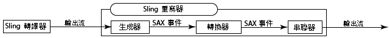

# 使用具有多個網域的 Dispatcher {#using-dispatcher-with-multiple-domains}

>[!NOTE]
>
>Dispatcher 版本與 AEM 無關。如果您依循的連結是內嵌於AEM或CQ檔案中的Dispatcher檔案，您可能會被重新導向至本頁面。

支援下列條件時，可使用Dispatcher在多個Web網域中處理頁面請求：

* 這兩個網域的網頁內容都儲存在單一AEM存放庫中。
* Dispatcher快取中的檔案可針對每個網域分別失效。

例如，某公司會發佈其兩個品牌的網站：品牌A和品牌B。網站頁面的內容是在AEM中撰寫，並儲存在相同的存放庫工作區中：

```
/
| - content  
   | - sitea  
       | - content nodes  
   | - siteb  
       | - content nodes
```

`BrandA.com`的頁面儲存在`/content/sitea`下方。 針對URL `https://BrandA.com/en.html`的客戶端請求將返回`/content/sitea/en`節點的呈現頁。 同樣地，`BrandB.com`的頁面儲存在`/content/siteb`下方。

使用Dispatcher來快取內容時，必須在用戶端HTTP請求中的頁面URL、快取中對應檔案的路徑，以及存放庫中對應檔案的路徑之間進行關聯。

## 用戶端請求

當用戶端傳送HTTP請求至Web伺服器時，必須將請求頁面的URL解析為Dispatcher快取中的內容，並最終解析為存放庫中的內容。


1. 域名系統發現為HTTP請求中的域名註冊的Web伺服器的IP地址。
1. HTTP要求會傳送至Web伺服器。
1. 會將HTTP要求傳遞至Dispatcher。
1. Dispatcher會判斷快取的檔案是否有效。 如果有效，則快取檔案會提供給用戶端。
1. 如果快取檔案無效，Dispatcher會從AEM發佈例項要求新轉譯的頁面。

## 快取失效

當Dispatcher排清復寫代理請求Dispatcher讓快取的檔案失效時，儲存庫中內容的路徑必須解析為快取中的內容。


1. 頁面會在AEM製作例項上啟動，而內容會複製到發佈例項。
1. Dispatcher排清代理程式會呼叫Dispatcher，使已復寫內容的快取失效。
1. Dispatcher會接觸一或多個.stat檔案，使快取的檔案無效。

若要使用具有多個網域的Dispatcher，您需要設定AEM、Dispatcher和您的Web伺服器。 本頁所述的解決方案是一般性的，並適用於大多數環境。 由於某些AEM拓撲很複雜，您的解決方案可能需要進一步的自訂設定，才能解決特定問題。 您可能需要調整示例以滿足現有的IT基礎架構和管理策略。

## URL對應{#url-mapping}

若要讓網域URL和內容路徑可解析為快取檔案，在程式中的某個時間點，必須轉譯檔案路徑或頁面URL。 提供下列常見策略的說明，其中路徑或URL轉譯會發生在程式中的不同點：

* （建議）AEM發佈例項使用Sling對應來解決資源，以實作內部URL重新寫入規則。 網域URL會轉譯為內容存放庫路徑。 請參閱[AEM重寫傳入的URL](#aem-rewrites-incoming-urls)。
* Web伺服器使用內部URL重寫規則，將域URL轉譯為快取路徑。 請參閱[Web伺服器重寫傳入的URL](#the-web-server-rewrites-incoming-urls)。

一般建議將短URL用於網頁。 通常，頁面URL會反映包含Web內容的存放庫資料夾結構。 不過，URL不會顯示最上層的存放庫節點，例如`/content`。 用戶端不一定知道AEM存放庫的結構。

## 一般要求{#general-requirements}

您的環境必須實作下列設定，以支援Dispatcher使用多個網域：

* 每個網域的內容位於存放庫的個別分支中（請參閱下方的範例環境）。
* Dispatcher排清復寫代理是在AEM發佈執行個體上設定。 （請參閱[從發佈執行個體使Dispatcher快取失效](page-invalidate.md)。）
* 域名系統將域名解析為Web伺服器的IP地址。
* Dispatcher快取會鏡像AEM內容存放庫的目錄結構。 Web伺服器的文檔根目錄下的檔案路徑與儲存庫中檔案的路徑相同。

## 提供的範例{#environment-for-the-provided-examples}的環境

提供的範例解決方案適用於具有下列特徵的環境：

* AEM製作和發佈例項部署在Linux系統上。
* Apache HTTPD是部署在Linux系統上的Web伺服器。
* AEM內容儲存庫和Web伺服器的文檔根目錄使用以下檔案結構(Apache Web伺服器的文檔根目錄為/`usr/lib/apache/httpd-2.4.3/htdocs)`:

   **存放庫**

```
  | - /content  
    | - sitea  
  |    | - content nodes 
    | - siteb  
       | - conent nodes
```

**Web伺服器的文檔根目錄**

```
  | - /usr  
    | - lib  
      | - apache  
        | - httpd-2.4.3  
          | - htdocs  
            | - content  
              | - sitea  
                 | - content nodes 
              | - siteb  
                 | - content nodes
```

## AEM重寫傳入的URL {#aem-rewrites-incoming-urls}

Sling對應以取得資源解析度，可讓您將傳入的URL與AEM內容路徑建立關聯。 在AEM發佈例項上建立對應，以便從Dispatcher轉譯請求解析至存放庫中的正確內容。

頁面呈現的Dispatcher請求會使用從Web伺服器傳遞的URL來識別頁面。 當URL包含網域名稱時，Sling對應會將URL解析為內容。 下圖說明了`branda.com/en.html` URL到`/content/sitea/en`節點的映射。


Dispatcher快取會鏡像存放庫節點結構。 因此，當頁面啟動發生時，導致對快取頁面無效的請求不需要URL或路徑轉換。


## 在Web伺服器{#define-virtual-hosts-on-the-web-server}上定義虛擬主機

在Web伺服器上定義虛擬主機，以便可以將不同的文檔根分配給每個Web域：

* Web伺服器必須為每個Web域定義虛擬域。
* 對於每個域，將文檔根配置為與包含域Web內容的儲存庫中的資料夾一致。
* 每個虛擬網域也必須包含與Dispatcher相關的設定，如[安裝Dispatcher](dispatcher-install.md)頁面所述。

以下示例`httpd.conf`檔案為Apache Web伺服器配置兩個虛擬域：

* 伺服器名稱（與域名一致）是branda.com（第16行）和brandb.com（第30行）。
* 每個虛擬網域的檔案根目錄是Dispatcher快取中包含網站頁面的目錄。 （第17和第31行）

使用此配置，Web伺服器在收到`https://branda.com/en/products.html`的請求時執行以下操作：

* 將URL與虛擬主機（`ServerName`為`branda.com.`）關聯

* 將URL轉送至Dispatcher。

### httpd.conf {#httpd-conf}

```xml
# load the Dispatcher module
LoadModule dispatcher_module modules/mod_dispatcher.so
# configure the Dispatcher module
<IfModule disp_apache2.c>
 DispatcherConfig conf/dispatcher.any
 DispatcherLog    logs/dispatcher.log  
 DispatcherLogLevel 3
 DispatcherNoServerHeader 0 
 DispatcherDeclineRoot 0
 DispatcherUseProcessedURL 0
 DispatcherPassError 0
</IfModule>

# Define virtual host for brandA.com
<VirtualHost *:80>
  ServerName branda.com
  DocumentRoot /usr/lib/apache/httpd-2.4.3/htdocs/content/sitea
   <Directory /usr/lib/apache/httpd-2.4.3/htdocs/content/sitea>
     <IfModule disp_apache2.c>
       SetHandler dispatcher-handler
       ModMimeUsePathInfo On
     </IfModule>
     Options FollowSymLinks
     AllowOverride None
   </Directory>
</VirtualHost>

# define virtual host for brandB.com
<VirtualHost *:80>
  ServerName brandB.com
  DocumentRoot /usr/lib/apache/httpd-2.4.3/htdocs/content/siteb
   <Directory /usr/lib/apache/httpd-2.4.3/htdocs/content/siteb>
     <IfModule disp_apache2.c>
       SetHandler dispatcher-handler
       ModMimeUsePathInfo On
     </IfModule>
     Options FollowSymLinks
     AllowOverride None
   </Directory>
</VirtualHost>

# document root for web server
DocumentRoot "/usr/lib/apache/httpd-2.4.3/htdocs"
```

請注意，虛擬主機會繼承主伺服器區段中設定的[DispatcherConfig](dispatcher-install.md#main-pars-67-table-7)屬性值。 虛擬主機可以包含其自己的DispatcherConfig屬性，以覆寫主要伺服器配置。

### 將Dispatcher設定為處理多個網域{#configure-dispatcher-to-handle-multiple-domains}

若要支援包含網域名稱及其對應虛擬主機的URL，請定義下列Dispatcher伺服器陣列：

* 為每個虛擬主機配置Dispatcher場。 這些伺服器會處理來自Web伺服器的每個網域的請求、檢查快取檔案，以及從轉譯器要求頁面。
* 設定Dispatcher伺服器陣列，用於使快取的內容失效，而不論內容屬於哪個網域。 此伺服器陣列會處理來自排清Dispatcher復寫代理的檔案無效請求。

### 為虛擬主機建立Dispatcher伺服器陣列

虛擬主機的伺服器陣列必須具備下列設定，以便將用戶端HTTP請求中的URL解析為Dispatcher快取中的正確檔案：

* 將`/virtualhosts`屬性設定為域名。 此屬性可讓Dispatcher將伺服器陣列與網域建立關聯。
* `/filter`屬性可讓您存取在網域名稱部分之後截斷之請求URL的路徑。 例如，對於`https://branda.com/en.html` URL，路徑會解譯為`/en.html`，因此篩選器必須允許存取此路徑。

* `/docroot`屬性設為Dispatcher快取中網域網站內容的根目錄路徑。 此路徑會作為原始請求之串連URL的前置詞。 例如，`/usr/lib/apache/httpd-2.4.3/htdocs/sitea`的docroot會使`https://branda.com/en.html`的要求解析為`/usr/lib/apache/httpd-2.4.3/htdocs/sitea/en.html`檔案。

此外，必須將AEM發佈例項指定為虛擬主機的呈現。 視需要設定其他伺服器陣列屬性。 以下代碼是branda.com域的縮寫伺服器陣列配置：

```xml
/farm_sitea  {     
    ...
    /virtualhosts { "branda.com" }
    /renders {
      /rend01  { /hostname "127.0.0.1"  /port "4503" }
    }
    /filter {
      /0001 { /type "deny"  /glob "*" }
      /0023 { /type "allow" /glob "*/en*" }  
      ...
     }
    /cache {
      /docroot "/usr/lib/apache/httpd-2.4.3/htdocs/content/sitea"
      ...
   }
   ...
}
```

### 建立快取失效的Dispatcher伺服器陣列

處理讓快取檔案失效的請求時，需要Dispatcher伺服器陣列。 此場必須能夠訪問每個虛擬主機的docroot目錄中的.stat檔案。

下列屬性設定可讓AEM從快取中的檔案解析Dispatcher內容存放庫中的檔案：

* 將`/docroot`屬性設定為Web伺服器的預設域。 通常，這是建立`/content`資料夾的目錄。 Linux上Apache的範例值為`/usr/lib/apache/httpd-2.4.3/htdocs`。
* `/filter`屬性允許訪問`/content`目錄下的檔案。

`/statfileslevel`屬性必須足夠高，以便在每個虛擬主機的根目錄中建立.stat檔案。 此屬性可讓每個網域的快取分別失效。 對於示例設定，`/statfileslevel`值`2`在`*docroot*/content/sitea`目錄和`*docroot*/content/siteb`目錄中建立.stat檔案。

此外，必須將發佈執行個體指定為虛擬主機的呈現。 視需要設定其他伺服器陣列屬性。 以下程式碼是用於使快取失效的伺服器陣列的縮寫設定：

```xml
/farm_flush {  
    ...
    /virtualhosts   { "invalidation_only" }
    /renders  {
      /rend01  { /hostname "127.0.0.1" /port "4503" }
    }
    /filter   {
      /0001 { /type "deny"  /glob "*" }
      /0023 { /type "allow" /glob "*/content*" } 
      ...
      }
    /cache  {
       /docroot "/usr/lib/apache/httpd-2.4.3/htdocs"
       /statfileslevel "2"
       ...
   }
   ...
}
```

當您啟動Web伺服器時，Dispatcher記錄檔（在除錯模式中）會指出所有伺服器場的初始化：

```shell
Dispatcher initializing (build 4.1.2)
[Fri Nov 02 16:27:18 2012] [D] [24974(140006182991616)] farms[farm_sitea].cache.docroot = /usr/lib/apache/httpd-2.4.3/htdocs/content/sitea
[Fri Nov 02 16:27:18 2012] [D] [24974(140006182991616)] farms[farm_siteb].cache.docroot = /usr/lib/apache/httpd-2.4.3/htdocs/content/siteb
[Fri Nov 02 16:27:18 2012] [D] [24974(140006182991616)] farms[farm_flush].cache.docroot = /usr/lib/apache/httpd-2.4.3/htdocs
[Fri Nov 02 16:27:18 2012] [I] [24974(140006182991616)] Dispatcher initialized (build 4.1.2)
```

### 配置資源解析度{#configure-sling-mapping-for-resource-resolution}的Sling映射

使用Sling對應來解析資源，讓網域型URL解析為AEM發佈例項上的內容。 資源對應會將傳入的URL從Dispatcher（原始來自用戶端HTTP請求）轉譯為內容節點。

若要了解Sling資源對應，請參閱Sling檔案中的[資源解析度的對應](https://sling.apache.org/site/mappings-for-resource-resolution.html)。

通常，下列資源需要對應，但可能需要其他對應：

* 內容頁面的根節點（`/content`下）
* 頁面使用的設計節點（`/etc/designs`下方）
* `/libs`資料夾

建立內容頁的映射後，要發現其他所需的映射，請使用Web瀏覽器在Web伺服器上開啟頁。 在發佈例項的error.log檔案中，找到找不到資源的相關訊息。 以下示例消息指示`/etc/clientlibs`的映射是必需的：

```shell
01.11.2012 15:59:24.601 *INFO* [10.36.34.243 [1351799964599] GET /etc/clientlibs/foundation/jquery.js HTTP/1.1] org.apache.sling.engine.impl.SlingRequestProcessorImpl service: Resource /content/sitea/etc/clientlibs/foundation/jquery.js not found
```

>[!NOTE]
>
>預設Apache Sling重寫程式的linkchecker轉換器會自動修改頁面中的超連結，以防止中斷的連結。 不過，只有在連結目標為HTML或HTM檔案時，才會執行連結重新寫入。 若要更新其他檔案類型的連結，請建立變壓器元件，並將其新增至HTML重寫器管道。

### 示例資源映射節點

下表列出了為branda.com域實現資源映射的節點。 會為`brandb.com`網域建立類似的節點，例如`/etc/map/http/brandb.com`。 在所有情況下，當頁面HTML中的參考無法在Sling內容中正確解析時，都需要對應。

| 節點路徑 | 類型 | 屬性 |
|--- |--- |--- |
| `/etc/map/http/branda.com` | sling：對應 | 名稱：sling:internalRedirect類型：字串值：/content/sitea |
| `/etc/map/http/branda.com/libs` | sling：對應 | 名稱：sling:internalRedirect <br/>類型：字串<br/>值：/libs |
| `/etc/map/http/branda.com/etc` | sling：對應 |  |
| `/etc/map/http/branda.com/etc/designs` | sling：對應 | 名稱：sling:internalRedirect <br/>VType:字串<br/>值：/etc/designs |
| `/etc/map/http/branda.com/etc/clientlibs` | sling：對應 | 名稱：sling:internalRedirect <br/>VType:字串<br/>值：/etc/clientlibs |

## 配置Dispatcher排清復寫代理{#configuring-the-dispatcher-flush-replication-agent}

AEM發佈例項上的Dispatcher排清復寫代理程式必須傳送無效請求至正確的Dispatcher伺服器陣列。 若要定位伺服器陣列，請使用Dispatcher排清復寫代理的URI屬性（在「傳輸」標籤上）。 包含Dispatcher伺服器陣列的`/virtualhost`屬性值，此伺服器陣列已設定為讓快取失效：

`https://*webserver_name*:*port*/*virtual_host*/dispatcher/invalidate.cache`

例如，要使用上一個示例的`farm_flush`場，URI為`https://localhost:80/invalidation_only/dispatcher/invalidate.cache`。


## Web伺服器重寫傳入的URL {#the-web-server-rewrites-incoming-urls}

使用Web伺服器的內部URL重新寫入功能，將網域型URL轉譯為Dispatcher快取中的檔案路徑。 例如，`https://brandA.com/en.html`頁的客戶端請求被轉譯為Web伺服器的文檔根目錄中的`content/sitea/en.html`檔案。


Dispatcher快取會鏡像存放庫節點結構。 因此，當頁面啟動發生時，產生的讓快取頁面失效的請求不需要URL或路徑轉譯。


## 在Web伺服器{#define-virtual-hosts-and-rewrite-rules-on-the-web-server}上定義虛擬主機和重寫規則

在Web伺服器上配置以下方面：

* 為每個Web網域定義虛擬主機。
* 對於每個域，將文檔根配置為與包含域Web內容的儲存庫中的資料夾一致。
* 對於每個虛擬域，建立一個URL更名規則，該規則將傳入的URL轉換為快取檔案的路徑。
* 每個虛擬網域也必須包含與Dispatcher相關的設定，如[安裝Dispatcher](dispatcher-install.md)頁面所述。
* Dispatcher模組必須設定為使用Web伺服器已重寫的URL。 （請參閱[安裝Dispatcher](dispatcher-install.md)中的`DispatcherUseProcessedURL`屬性。）

以下示例httpd.conf檔案為Apache Web伺服器配置兩個虛擬主機：

* 伺服器名稱（與域名一致）是`brandA.com`（行16）和`brandB.com`（行32）。

* 每個虛擬網域的檔案根目錄是Dispatcher快取中包含網站頁面的目錄。 （第20和33行）
* 每個虛擬網域的URL重寫規則是規則運算式，用快取中的頁面路徑前置所請求頁面的路徑。 （第19和35行）
* `DispatherUseProcessedURL`屬性設定為`1`。 （第10行）

例如，Web伺服器在收到具有`https://brandA.com/en/products.html` URL的請求時，會執行下列動作：

* 將URL與虛擬主機（`ServerName`為`brandA.com.`）關聯
* 將URL重新寫入為`/content/sitea/en/products.html.`
* 將URL轉送至Dispatcher。

### httpd.conf {#httpd-conf-1}

```xml
# load the Dispatcher module
LoadModule dispatcher_module modules/mod_dispatcher.so
# configure the Dispatcher module
<IfModule disp_apache2.c>
 DispatcherConfig conf/dispatcher.any
 DispatcherLog    logs/dispatcher.log  
 DispatcherLogLevel 3
 DispatcherNoServerHeader 0 
 DispatcherDeclineRoot 0
 DispatcherUseProcessedURL 1
 DispatcherPassError 0
</IfModule>

# Define virtual host for brandA.com
<VirtualHost *:80>
  ServerName branda.com
  DocumentRoot /usr/lib/apache/httpd-2.4.3/htdocs/content/sitea
  RewriteEngine  on
  RewriteRule    ^/(.*)\.html$  /content/sitea/$1.html [PT]
   <Directory /usr/lib/apache/httpd-2.4.3/htdocs/content/sitea>
     <IfModule disp_apache2.c>
       SetHandler dispatcher-handler
       ModMimeUsePathInfo On
     </IfModule>
     Options FollowSymLinks
     AllowOverride None
   </Directory>
</VirtualHost>

# define virtual host for brandB.com
<VirtualHost *:80>
  ServerName brandB.com
  DocumentRoot /usr/lib/apache/httpd-2.4.3/htdocs/content/siteb
  RewriteEngine  on
  RewriteRule    ^/(.*)\.html$  /content/siteb/$1.html [PT]
   <Directory /usr/lib/apache/httpd-2.4.3/htdocs/content/siteb>
     <IfModule disp_apache2.c>
       SetHandler dispatcher-handler
       ModMimeUsePathInfo On
     </IfModule>
     Options FollowSymLinks
     AllowOverride None
   </Directory>
</VirtualHost>

# document root for web server
DocumentRoot "/usr/lib/apache/httpd-2.4.3/htdocs"
```

### 設定Dispatcher伺服器陣列{#configure-a-dispatcher-farm}

當Web伺服器重寫URL時，Dispatcher需要根據[設定Dispatcher](dispatcher-configuration.md)定義的單一伺服器陣列。 要支援Web伺服器虛擬主機和URL更名規則，需要以下配置：

* `/virtualhosts`屬性必須包含所有VirtualHost定義的ServerName值。
* `/statfileslevel`屬性必須足夠高，才能在包含每個域的內容檔案的目錄中建立.stat檔案。

下列範例設定檔案是以隨Dispatcher安裝的範例`dispatcher.any`檔案為基礎。 要支援前一個`httpd.conf`檔案的Web伺服器配置，需要進行以下更改：

* `/virtualhosts`屬性會使Dispatcher處理`brandA.com`和`brandB.com`網域的請求。 （第12行）
* `/statfileslevel`屬性設定為2，以便在包含域Web內容的每個目錄中建立stat檔案（第41行）:`/statfileslevel "2"`

與往常一樣，快取的檔案根與Web伺服器的檔案根（第40行）相同：`/usr/lib/apache/httpd-2.4.3/htdocs`

### `dispatcher.any` {#dispatcher-any}

```xml
/name "testDispatcher"
/farms
  {
  /dispfarm0
    {  
    /clientheaders
      {
      "*"
      }      
    /virtualhosts
      {
      "brandA.com" "brandB.com"
      }
    /renders
      {
      /rend01    {  /hostname "127.0.0.1"   /port "4503"  }
      }
    /filter
      {
      /0001 { /type "deny"  /glob "*" }
      /0023 { /type "allow" /glob "*/content*" }  # disable this rule to allow mapped content only
      /0041 { /type "allow" /glob "* *.css *"   }  # enable css
      /0042 { /type "allow" /glob "* *.gif *"   }  # enable gifs
      /0043 { /type "allow" /glob "* *.ico *"   }  # enable icos
      /0044 { /type "allow" /glob "* *.js *"    }  # enable javascript
      /0045 { /type "allow" /glob "* *.png *"   }  # enable png
      /0046 { /type "allow" /glob "* *.swf *"   }  # enable flash
      /0061 { /type "allow" /glob "POST /content/[.]*.form.html" }  # allow POSTs to form selectors under content
      /0062 { /type "allow" /glob "* /libs/cq/personalization/*"  }  # enable personalization
      /0081 { /type "deny"  /glob "GET *.infinity.json*" }
      /0082 { /type "deny"  /glob "GET *.tidy.json*"     }
      /0083 { /type "deny"  /glob "GET *.sysview.xml*"   }
      /0084 { /type "deny"  /glob "GET *.docview.json*"  }
      /0085 { /type "deny"  /glob "GET *.docview.xml*"  }      
      /0086 { /type "deny"  /glob "GET *.*[0-9].json*" }
      /0090 { /type "deny"  /glob "* *.query.json*" }
      }
    /cache
      {
      /docroot "/usr/lib/apache/httpd-2.4.3/htdocs"
      /statfileslevel "2"
      /allowAuthorized "0"
      /rules
        {
        /0000  { /glob "*"     /type "allow"  }
        }
      /invalidate
        {
        /0000  {   /glob "*" /type "deny"  }
        /0001 {  /glob "*.html" /type "allow"  }
        }
      /allowedClients
        {
        }     
      }
    /statistics
      {
      /categories
        {
        /html  { /glob "*.html" }
        /others  {  /glob "*"  }
        }
      }
    }
  }
```

>[!NOTE]
>
>由於已定義單一Dispatcher伺服器陣列，因此AEM發佈例項上的Dispatcher排清復寫代理不需要特殊設定。

## 重寫指向非HTML檔案的連結{#rewriting-links-to-non-html-files}

若要重寫副檔名為.html或.htm以外的檔案的參考，請建立Sling重寫器變壓器元件，並將其新增至預設重寫器管道。

當資源路徑在Web伺服器上下文中無法正確解析時，重寫引用。 例如，影像產生元件建立連結(例如/content/sitea/en/products.navimage.png)時，需要變壓器。 [如何建立全功能網際網路網站](https://helpx.adobe.com/experience-manager/6-3/sites/developing/using/the-basics.html)的頂層導覽元件會建立此類連結。

[Sling rewriter](https://sling.apache.org/documentation/bundles/output-rewriting-pipelines-org-apache-sling-rewriter.html)是後置處理Sling輸出的模組。 重寫器的SAX管線實現由發生器、一個或多個變壓器和串列器組成：

* **產生器：** 剖析Sling輸出資料流（HTML檔案），並在遇到特定元素類型時產生SAX事件。
* **變壓器：** 偵聽SAX事件，然後修改事件目標（HTML元素）。重寫器管道包含零個或多個變壓器。 變壓器依序執行，將SAX事件按順序傳遞到下一個變壓器。
* **序列化程式：** 序列化輸出，包括每個變壓器的修改。



### AEM預設重寫器管道{#the-aem-default-rewriter-pipeline}

AEM使用預設管道重寫器來處理文字/html類型的檔案：

* 生成器解析HTML文檔並在遇到a、img、區域、表單、基、連結、指令碼和正文元素時生成SAX事件。 生成器別名為`htmlparser`。
* 管道包括以下變壓器：`linkchecker`、`mobile`、`mobiledebug`、`contentsync`。 `linkchecker`轉換器將引用的HTML或HTM檔案的路徑外部化，以防止連結損毀。
* 序列化程式會寫入HTML輸出。 序列化程式別名為htmlwriter。

`/libs/cq/config/rewriter/default`節點定義管道。

### 建立變壓器{#creating-a-transformer}

執行以下任務以建立變壓器元件並在管道中使用它：

1. 實作`org.apache.sling.rewriter.TransformerFactory`介面。 此類建立變壓器類的實例。 指定`transformer.type`屬性（變壓器別名）的值，並將類配置為OSGi服務元件。
1. 實作`org.apache.sling.rewriter.Transformer`介面。 要最小化工作量，可以擴展`org.apache.cocoon.xml.sax.AbstractSAXPipe`類。 覆蓋startElement方法以自定義重寫行為。 會針對每個傳遞至變壓器的SAX事件呼叫此方法。
1. 捆綁並部署類。
1. 將設定節點新增至AEM應用程式，將變壓器新增至管道。

>[!TIP]
>您可以改為配置TransformerFactory，將變壓器插入定義的每個重寫器中。 因此，您不需要設定管道：
>
>* 將`pipeline.mode`屬性設定為`global`。
>* 將`service.ranking`屬性設定為正整數。
>* 請勿包含`pipeline.type`屬性。


>[!NOTE]
>
>使用內容套件Maven外掛程式的[多模組](https://helpx.adobe.com/tw/experience-manager/aem-previous-versions.html)原型來建立您的Maven專案。 POM會自動建立和安裝內容套件。

下列範例實作會重寫參考至影像檔案的轉換器。

* MyRewriterTransformerFactory類可實例化MyRewriterTransformer對象。 pipeline.type屬性將變壓器別名設定為mytransformer。 為了將別名包括在管道中，管道配置節點將此別名包括在變壓器清單中。
* MyRewriterTransformer類覆蓋AbstractSAXTransfer類的startElement方法。 startElement方法會重寫img元素的src屬性值。

這些範例不健全，不應用於生產環境。

### TransformerFactory實施示例{#example-transformerfactory-implementation}

```java
package com.adobe.example;

import org.apache.felix.scr.annotations.Component;
import org.apache.felix.scr.annotations.Service;
import org.apache.felix.scr.annotations.Property;

import org.apache.sling.rewriter.Transformer;
import org.apache.sling.rewriter.TransformerFactory;

@Component
@Service
public class MyRewriterTransformerFactory implements TransformerFactory {
    /* Define the alias */
    @Property(value="mytransformer")
    static final String PIPELINE_TYPE ="pipeline.type";
 
    public Transformer createTransformer() {
        
        return new MyRewriterTransformer ();
    }
}
```

### 變壓器實施範例{#example-transformer-implementation}

```java
package com.adobe.example;

import java.io.IOException;

import org.apache.cocoon.xml.sax.AbstractSAXPipe;

import org.apache.sling.api.SlingHttpServletRequest;
import org.apache.sling.rewriter.ProcessingComponentConfiguration;
import org.apache.sling.rewriter.ProcessingContext;
import org.apache.sling.rewriter.Transformer;

import org.slf4j.Logger;
import org.slf4j.LoggerFactory;

import org.xml.sax.Attributes;
import org.xml.sax.SAXException;
import org.xml.sax.helpers.AttributesImpl;

import javax.servlet.http.HttpServletRequest;

public class MyRewriterTransformer extends AbstractSAXPipe implements Transformer {

 private static final Logger log = LoggerFactory.getLogger(MyRewriterTransformer.class);
 private SlingHttpServletRequest httpRequest; 
 /* The element and attribute to act on  */
 private static final String ATT_NAME = new String("src");
 private static final String EL_NAME = new String("img");

 public MyRewriterTransformer () {
 }
 public void dispose() {
 }
 public void init(ProcessingContext context, ProcessingComponentConfiguration config) throws IOException {
  this.httpRequest = context.getRequest();
  log.debug("Transforming request {}.", httpRequest.getRequestURI());
 }
 @Override
 public void startElement (String nsUri, String localname, String qname, Attributes atts) throws SAXException {
  /* copy the element attributes */
  AttributesImpl linkAtts = new AttributesImpl(atts); 
  /* Only interested in EL_NAME elements */
  if(EL_NAME.equalsIgnoreCase(localname)){

   /* iterate through the attributes of the element and act only on ATT_NAME attributes */
   for (int i=0; i < linkAtts.getLength(); i++) {
    if (ATT_NAME.equalsIgnoreCase(linkAtts.getLocalName(i))) {
     String path_in_link = linkAtts.getValue(i);

     /* use the resource resolver of the http request to reverse-resolve the path  */
     String mappedPath = httpRequest.getResourceResolver().map(httpRequest, path_in_link);

     log.info("Tranformed {} to {}.", path_in_link,mappedPath);

     /* update the attribute value */
     linkAtts.setValue(i,mappedPath);
    }
   }

  }
        /* return updated attributes to super and continue with the transformer chain */
 super.startElement(nsUri, localname, qname, linkAtts);
 }
}
```

### 將變壓器添加到重寫器管道{#adding-the-transformer-to-a-rewriter-pipeline}

建立JCR節點，定義使用變壓器的管線。 以下節點定義將建立處理文本/html檔案的管道。 使用HTML的預設AEM產生器和剖析器。

>[!NOTE]
>
>如果將變壓器屬性`pipeline.mode`設定為`global`，則無需配置管線。 `global`模式將變壓器插入所有管道中。

### 重寫配置節點 — XML表示{#rewriter-configuration-node-xml-representation}

```xml
<?xml version="1.0" encoding="UTF-8"?>
<jcr:root xmlns:jcr="https://www.jcp.org/jcr/1.0" xmlns:nt="https://www.jcp.org/jcr/nt/1.0"
    jcr:primaryType="nt:unstructured"
    contentTypes="[text/html]"
    enabled="{Boolean}true"
    generatorType="htmlparser"
    order="5"
    serializerType="htmlwriter"
    transformerTypes="[mytransformer]">
</jcr:root>
```

下圖顯示節點的CRXDE Lite表示：


