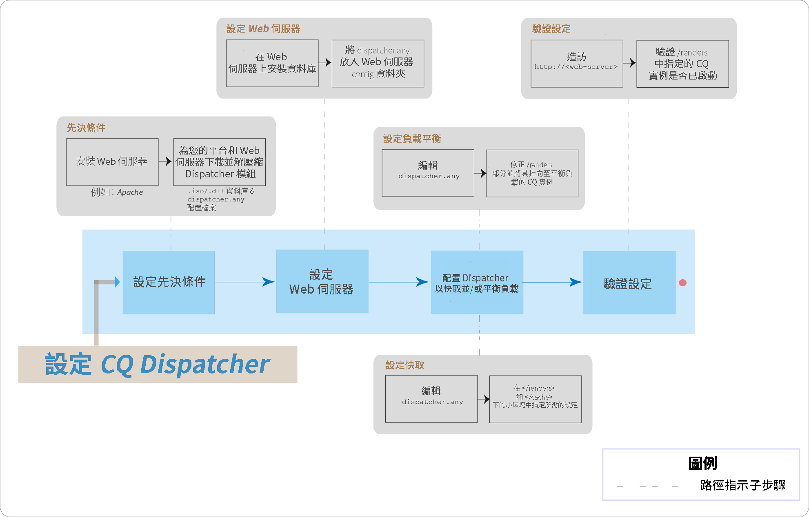

# AEM Dispatcher熱門問題常見問題集



## 簡介

### 甚麼是Dispatcher？

Dispatcher是Adobe Experience Manager的快取和/或負載平衡工具，可協助實現快速動態網頁製作環境。對於快取，Dispatcher會當作HTTP伺服器的一部分運作，例如Apache，目的是為了儲存(或「快取」)盡可能多靜態網站內容，並盡可能不常存取網站的版面引擎。在負載平衡角色中，Dispatcher會分配使用者要求(載入)至不同的AEM例項(轉譯)。

對於快取，Dispatcher模組會使用Web伺服器提供靜態內容的能力。Dispatcher會將快取的文件置於Web伺服器的文件根目錄中。

### Dispatcher如何執行快取？

Dispatcher使用網站伺服器提供靜態內容的能力。Dispatcher會將快取的文件儲存在網站伺服器的文件根目錄中。Dispatcher有兩種主要方法，可在網站變更時更新快取內容。

* **「內容更新** 」會移除已變更的頁面，以及直接關聯的檔案。
* **自動失效序列化** 會自動失效更新之後可能過時的快取部分。例如，它有效標示相關頁面已過時，不會刪除任何內容。

### 負載平衡有哪些優點？

負載平衡會跨數個AEM實例分發使用者要求(負載)。下列清單說明負載平衡的優點：

* **提高處理能力**：這表示Dispatcher會分享數個AEM例項之間的文件請求。由於每個執行個體的文件要較少，因此您的回應時間更短。Dispatcher會保留每個文件類別的內部統計資料，讓它能夠有效地預估載入和分配查詢。
* **提高安全性的涵蓋範圍**：如果Dispatcher未從例項接收回應，則會自動將請求轉送至其他例項之一。因此，如果某個例項無法使用，唯一的效果就是網站的慢速變慢，與計算能力失去比例。

>[!NOTE]
>
>如需詳細資訊，請參閱 [Dispatcher概述頁面](dispatcher.md)

## 安裝及設定

### 我要從何處下載Dispatcher模組？

您可以從 [Dispatcher發行說明](release-notes.md) 頁面下載最新的Dispatcher模組。

### 如何安裝Dispatcher模組？

請參閱 [安裝Dispatcher](dispatcher-install.md) 頁面

### 如何設定Dispatcher模組？

請參閱 [Configuring Dispatcher](dispatcher-configuration.md) 頁面。

### 如何為作者實例設定Dispatcher？

如需詳細步驟，請參閱 [「使用Dispatcher搭配作者實例](dispatcher.md#using-a-dispatcher-with-an-author-server) 」。

### 如何設定包含多個網域的Dispatcher？

您可以設定具有多個網域的CQ Dispatcher，前提是網域符合下列條件：

* 這兩個網域的網頁內容都會儲存在單一AEM存放庫中
* Dispatcher快取中的檔案可分別為每個網域而失效

請參閱 [「搭配多個網域](dispatcher-domains.md) 使用Dispatcher」以取得詳細資訊。

### 如何設定Dispatcher，讓使用者的所有請求路由至相同的Publish例項？

您可以使用 [黏著連結](dispatcher-configuration.md#identifying-a-sticky-connection-folder-stickyconnectionsfor) 功能，以確保所有適用於使用者的文件都能在相同的AEM例項上處理。如果您使用個人化頁面和工作階段資料，此功能很重要。資料會儲存在例項中。因此，來自相同使用者的後續請求必須返回該例項，否則資料會遺失。

由於嚴格連接限制Dispatcher的最佳化請求能力，因此只有在必要時才應使用此方法。您可以指定包含「自黏」文件的檔案夾，以確保該檔案夾中的所有文件都會在同一個執行個體上處理。

### 我可以使用黏著連線和快取嗎？

對於大部分使用嚴格連線的頁面，您應關閉快取。否則，不論作業內容為何，都會向所有使用者顯示相同的頁面例項。

對於部分應用程式，您可以同時使用自黏連線和快取。例如，如果您顯示將資料寫入工作階段的表單，您可以使用嚴格連接和串連。

### Dispatcher和AEM Publish實例是否可駐留在同一部實體機器上？

是的，如果機器功能夠強大。不過，建議您在不同電腦上設定Dispatcher和AEM Publish例項。

通常，Publish例項位於防火牆內，Dispatcher位於DMZ中。如果您決定在同一部實體機器上同時擁有Publish instance和Dispatcher，請確定防火牆設定禁止從外部網路直接存取「發佈」執行個體。

### 我可以只快取具有特定擴充功能的檔案嗎？

是. 例如，如果您只想快取GIF檔案，請在dispatcher的快取區段中指定*. gif。

### 如何從快取中刪除檔案？

您可以使用HTTP要求刪除快取中的檔案。收到HTTP要求時，Dispatcher會從快取中刪除檔案。Dispatcher只有在收到頁面的用戶端要求時，才會再次快取檔案。以此方式刪除快取檔案適合不可能同時收到相同頁面要求的網站。

HTTP要求具有下列語法：

```
POST /dispatcher/invalidate.cache HTTP/1.1
CQ-Action: Activate
CQ-Handle: path-pattern
Content-Length: 0
```

Dispatcher會刪除具有符合CQ-Handle標題值的快取檔案和資料夾。例如，CQ-Handle `/content/geomtrixx-outdoors/en` 符合下列項目：

在幾何xx戶外目錄中命名為en的所有檔案(副檔名)都有名為 `_jcr_content` en目錄的目錄(如果它存在，則包含頁面的子節點的快取)，否則只會刪除目錄 `CQ-Action` en `Delete``Deactivate`。

如需此主題的詳細資訊，請參閱 [手動失效Dispatcher快取](page-invalidate.md)。

### 如何實作權限敏感性快取？

請參閱 [快取保全內容](permissions-cache.md) 頁面。

### 如何安全地在Dispatcher和CQ實例之間進行通訊？

請參閱 [Dispatcher Security CheckList](security-checklist.md) 和 [AEM Security Checklist](https://helpx.adobe.com/experience-manager/6-4/sites/administering/using/security-checklist.html) 頁面。

### Dispatcher問題 `jcr:content` 已變更為 `jcr%3acontent`

**問題**：我們最近在傳送程式層級遇到問題，其中一個ajax呼叫會取得某些資料表格CQ存放庫， `jcr:content` 並被編碼為 `jcr%3acontent` 造成錯誤的結果集。

**答案**：請使用 `ResourceResolver.map()` 方法取得使用/發佈的「友好」URL，並從中解決Dispatcher的快取問題。map()方法會將 `:` 冒號編碼為底線，而resolution()方法會將它們解碼回SLING JCR可讀格式。您需要使用map()方法產生用於Ajax呼叫的URL。

進一步閱讀： [https://sling.apache.org/documentation/the-sling-engine/mappings-for-resource-resolution.html#namespace-mangling](https://sling.apache.org/documentation/the-sling-engine/mappings-for-resource-resolution.html#namespace-mangling)

## 清除Dispatcher

### 如何在發佈例項上配置Dispatcher刷新代理程式？

請參閱 [「複製](https://helpx.adobe.com/content/help/en/experience-manager/6-4/sites/deploying/using/replication.html#ConfiguringyourReplicationAgents) 」頁面。

### 我要如何疑難排解Dispatcher的問題？

[請參閱此疑難排解文章](https://helpx.adobe.com/content/help/en/experience-manager/kb/troubleshooting-dispatcher-flushing-issues.html) ，以回答下列問題：

* 如何除錯Dispatcher快取中未儲存內容的情形？
* 我要如何除錯快取檔案未更新的情形？
* 我要如何除錯Dispatcher快顯相關無作用的情況？

如果Delete作業造成Dispatcher清除， [請使用Sensei Martin本社群部落格文章的因應措施](https://mkalugin-cq.blogspot.in/2012/04/i-have-been-working-on-following.html)。

### 如何從Dispatcher快取中清除DAM資產？

您可以使用「連鎖複製」功能。啓用此功能後，當從作者接收到複製時，dispatcher push代理會傳送一個刷新請求。

若要啓用：

1. [依照此處](page-invalidate.md#invalidating-dispatcher-cache-from-a-publishing-instance) 的步驟，在發佈時建立Flooning代理程式
1. 前往每個代理程式的組態和 **「觸發器** 」標籤上的「接收接收」 **** 方塊。

## 其他

Dispatcher如何判斷文件是否最新？
若要判斷文件是否為最新版本，Dispatcher會執行下列動作：

它會檢查文件是否受到自動失效。如果沒有，則會將該文件視為最新。
如果文件設定為自動失效，Dispatcher會檢查它是否比上次可用的變更較舊或較新。如果較舊，Dispatcher會要求AEM實例的目前版本，並取代快取中的版本。

### Dispatcher如何傳回文件？

您可以使用 [Dispatcher組態](dispatcher-configuration.md) 檔來定義Dispatcher快取文件的時機 `dispatcher.any`。Dispatcher會檢查可快取文件清單的請求。如果文件未在此清單中，Dispatcher會從AEM實例要求文件。

`/rules` 屬性會控制根據文件路徑快取的文件。不論 `/rules` 屬性為何，Dispatcher都不會在下列情況下快取文件：

* 如果請求URI包含問號 `(?)`。
* 這通常表示動態頁面，例如不需要快取的搜尋結果。
* 副檔名遺失。
* 網頁伺服器需要擴充功能來判斷文件類型(MIME類型)。
* 已設定驗證標題(可設定)
* 如果AEM實例回應下列標題：
   * no-cache
   * 無商店
   * 必須重新驗證

Dispatcher會將快取的檔案儲存在Web伺服器上，彷彿它們是靜態網站的一部分。如果使用者要求快取的文件，Dispatcher會檢查文件是否存在於Web伺服器的檔案系統中。如果是，則Dispatcher會傳回文件。如果沒有，Dispatcher會從AEM實例要求文件。

>[!NOTE]
>
>DET或HEAD(適用於HTTP標題)方法可由Dispatcher使用。如需回應標題快取的其他資訊，請參閱 [快取HTTP回應標題](dispatcher-configuration.md#caching-http-response-headers) 區段。

### 我可以在設定中實施多個Dispatcher嗎？

是. 在這種情況下，請確保兩個Dispatcher都能直接存取AEM網站。Dispatcher無法處理來自其他Dispatcher的請求。

