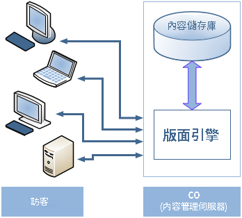
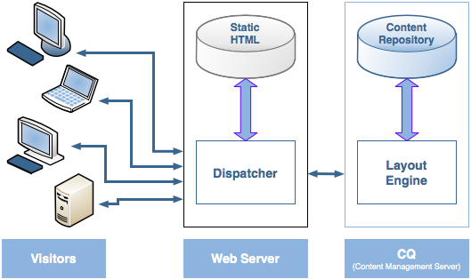
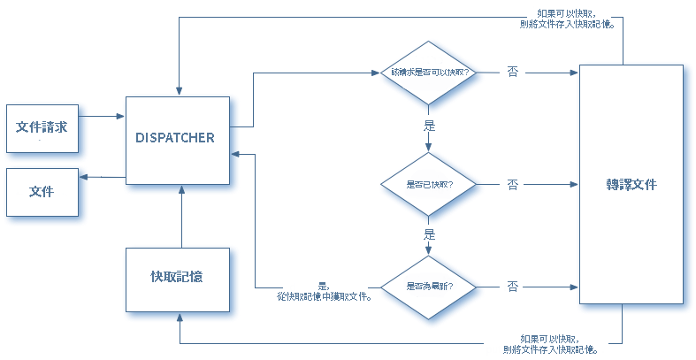
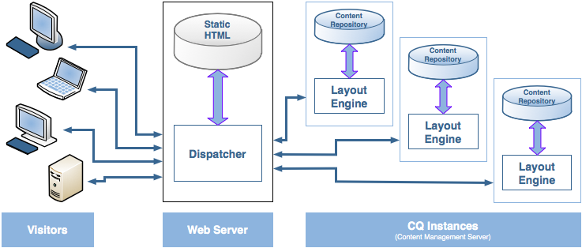

# Dispatcher概述 {#dispatcher-overview}

>[!NOTE]
>
>Dispatcher版本與AEM獨立。如果您關注Dispatcher文件的連結(內嵌於舊版AEM的文件中)，可能會重新導向至此頁面。

Dispatcher是Adobe Experience Manager的快取和/或負載平衡工具。使用AEM的Dispatcher也有助於保護AEM伺服器不受攻擊。因此，您可以搭配使用Dispatcher與企業級Web伺服器，以提高AEM實例的安全性。

部署Dispatcher的程序獨立於網站伺服器和作業系統平台：

1. 瞭解Dispatcher(本頁)。此外，請參閱 [有關傳送程式](https://helpx.adobe.com/experience-manager/using/dispatcher-faq.html)的常見問題。
1. 根據網頁伺服器文件安裝 [支援的網頁伺服器](https://helpx.adobe.com/experience-manager/6-3/sites/deploying/using/technical-requirements.html) 。

1. [在您的Web伺服器上安裝Dispatcher模組](dispatcher-install.md) ，並據以設定Web伺服器。
1. [配置Dispatcher](dispatcher-configuration.md) (dispatcher. any檔案)。

1. [設定AEM](page-invalidate.md) ，讓內容更新失效。

>[!NOTE]
>
>若要更深入瞭解Dispatcher如何與AEM搭配運作，請參閱 [2017年月的AEM社群專家詢問](https://bit.ly/ATACE0717)。

請視需要使用下列資訊：

* [Dispatcher Security Checklist](security-checklist.md)
* [Dispatcher知識庫](https://helpx.adobe.com/cq/kb/index/dispatcher.html)
* [最佳化網站快取效能](https://helpx.adobe.com/experience-manager/6-4/sites/deploying/using/configuring-performance.html)
* [搭配多個網域使用Dispatcher](dispatcher-domains.md)
* [搭配Dispatcher使用SSL](dispatcher-ssl.md)
* [實作權限感應快取](permissions-cache.md)
* [疑難排解Dispatcher問題疑難排解](dispatcher-troubleshooting.md)
* [Dispatcher熱門問題常見問題集](dispatcher-faq.md)

>[!NOTE]
>
>**Dispatcher** 最常見的用途是快取AEM **發佈例項**的回應，以提高對外發佈網站的回應速度和安全性。討論大多著重於此案例。
>
>但是，Dispatcher也可以用來提高 **作者執行個體的回應速度，**尤其是當您有大量使用者編輯和更新網站時。如需此案例的詳細資訊，請參閱 [下面的「使用Dispatcher搭配作者伺服器](#using-a-dispatcher-with-an-author-server)」。

## 為何使用Dispatcher實施快取？ {#why-use-dispatcher-to-implement-caching}

Web發佈有兩種基本方法：

* **靜態網頁伺服器**：例如Apache或IIS，非常簡單但快速。
* **內容管理伺服器**：提供動態、即時、智慧型內容，但需要更多的計算時間和其他資源。

Dispatcher可協助實現既快速又動態的環境。它可當成靜態HTML伺服器的一部分，例如Apache，其目標：

* 以靜態網站的形式儲存(或「快取」)許多網站內容
* 存取版面引擎。

也就是說：

* **靜態內容** 的處理速度和輕鬆程度完全相同；*此外，您還可以使用靜態網頁伺服器適用的管理和安全性工具*。

* **動態內容** 會視需要產生，而不會讓系統降低。

Dispatcher包含根據動態網站內容產生和更新靜態HTML的機制。您可以詳細指定哪些文件儲存為靜態檔案，以及一律產生動態檔案。

本節說明此項原則背後的原則。

### 靜態Web伺服器 {#static-web-server}


靜態網頁伺服器(例如Apache或IIS)會為您的網站訪客提供靜態HTML檔案。會建立靜態頁面一次，因此會針對每個請求傳遞相同的內容。

這個程序非常簡單，因此非常有效率。如果訪客請求檔案(例如HTML頁面)，檔案通常會直接取自記憶體，最壞的是從本機磁碟讀取檔案。靜態網頁伺服器已有相當一段時間可用，因此管理和安全管理有多種工具，而且與網路基礎架構密切整合。

### 內容管理伺服器 {#content-management-servers}



如果您使用內容管理伺服器(例如AEM)，進階版面引擎會處理來自訪客的請求。引擎會從儲存庫讀取內容，並結合樣式、格式和存取權限，將內容轉換為符合訪客需求和權限的文件。

這可讓您建立更豐富的動態內容，提高網站的彈性和功能。不過，版面引擎需要比靜態伺服器更強大的處理能力，因此當許多訪客使用系統時，此設定可能會很容易減緩。

## Dispatcher如何執行快取 {#how-dispatcher-performs-caching}



**快取目錄** ：Dispatcher模組使用網頁伺服器提供靜態內容的能力。Dispatcher會將快取的文件置於Web伺服器的文件根目錄中。

>[!NOTE]
>
>缺少HTTP標題快取的設定時，Dispatcher只會儲存頁面的HTML程式碼-並不會儲存HTTP標題。如果您在網站中使用不同的編碼，可能會發生問題，因為這些可能會遺失。若要啓用HTTP標題快取，請參閱 [設定Dispatcher快取。](https://helpx.adobe.com/experience-manager/dispatcher/using/dispatcher-configuration.html)

>[!NOTE]
>
>在網路附加儲存空間(NAS)上找出網頁伺服器的文件根目錄會造成效能降低。此外，在多個Web伺服器共用位於NAS上的文件根目錄時，執行複製動作時可能會發生發行者鎖定。

>[!NOTE]
>
>Dispatcher會將快取的文件儲存為等於要求的URL的結構。
>
>檔案名稱長度可能會限制作業系統層級的限制；例如，如果您具有許多選擇器的URL。

### 快取方法

Dispatcher有兩種主要方法，可在網站變更時更新快取內容。

* **「內容更新** 」會移除已變更的頁面，以及直接關聯的檔案。
* **自動失效序列化** 會自動失效更新之後可能過時的快取部分。i.e. 它有效標示相關頁面已過時，不會刪除任何內容。

### 內容更新

在內容更新中，一或多個AEM文件會變更。AEM會傳送匯集要求至Dispatcher，因此會據以更新快取：

1. 它會將已修改的檔案從快取中刪除。
1. 它會將從快取中開始的所有檔案刪除。例如，如果檔案/en/index.html已更新，則所有檔案都會以/en/index開始。刪除。此機制可讓您設計快取效率網站，尤其是在圖片導覽方面。
1. 它 *會接觸* 所謂 **的statfile**；如此會更新statafile的時間戳記，以指出上次變更的日期。

應注意以下幾點：

* 內容更新通常會與撰寫系統搭配使用，「知道」必須取代甚麼。
* 受內容更新影響的檔案會遭到移除，但無法立即取代。下次要求此檔案時，Dispatcher會從AEM實例擷取新檔案，並將它放置在快取中，以覆寫舊內容。
* 通常，自動產生的圖片會將頁面中的文字儲存在以相同控制代碼開頭的圖片檔案中，因此可確保該關聯存在。例如，您可以將頁面mypage.html的標題文字儲存為相同檔案夾中的圖片mbage. titlePicture. gif。如此每次更新頁面時，圖片都會自動從快取中刪除，因此您可以確定圖片永遠反映最新版本的頁面。
* 您可能有幾個狀態，例如每個語言檔案夾一個。如果更新頁面，AEM會尋找下一個包含statfile的上層檔案夾， *並潤飾* 檔案。

### 自動失效

自動失效會自動失效快取的部分-而不會實際刪除任何檔案。在每次內容更新時，會接觸所謂的statfile，因此其時間戳記會反映最後的內容更新。

Dispatcher會列出受自動失效的檔案清單。請求該清單的文件時，Dispatcher會將快取文件的日期與statefile的時間戳記進行比較：

* 如果快取的文件較新，Dispatcher會傳回它。
* 如果較舊，Dispatcher會從AEM實例擷取目前版本。

同樣地，應注意某些要點：

* 自動失效通常用於HTML頁面中複雜的關係。這些頁面包含連結和導覽項目，因此通常必須在內容更新後更新。如果您已自動產生PDF或圖片檔案，您也可以選擇自動廢止這些檔案。
* 自動失效不會在更新時間由傳送程式涉及任何動作，但觸控檔案除外。不過，觸控統計資料會自動產生快取內容，而不會將快取內容從快取中移除。

## Dispatcher如何傳回文件 {#how-dispatcher-returns-documents}



### 判斷文件是否受到快取

您可以 [定義要在配置檔案](https://helpx.adobe.com/experience-manager/dispatcher/using/dispatcher-configuration.html)中快取的Dispatcher快取。Dispatcher會檢查可快取文件清單的請求。如果文件未在此清單中，Dispatcher會從AEM實例要求文件。

在下列情況下，Dispatcher *一律* 會從AEM實例要求文件：

* 如果請求URI包含問號「？」。這通常表示動態頁面，例如不需要快取的搜尋結果。
* 副檔名遺失。網頁伺服器需要擴充功能來判斷文件類型(MIME類型)。
* 已設定驗證標題(可設定)

>[!NOTE]
>
>DET或HEAD(適用於HTTP標題)方法可由Dispatcher使用。如需回應標題快取的其他資訊，請參閱 [快取HTTP回應標題](https://helpx.adobe.com/experience-manager/dispatcher/using/dispatcher-configuration.html) 區段。

### 判斷文件是否快取

Dispatcher會將快取的檔案儲存在Web伺服器上，彷彿它們是靜態網站的一部分。如果使用者要求可快取的文件，Dispatcher會檢查該文件是否存在於Web伺服器的檔案系統中：

* 如果文件快取，Dispatcher會傳回檔案。
* 如果未快取，則Dispatcher會從AEM實例要求文件。

### 判斷文件是否最新

若要瞭解文件是否已更新，Dispatcher會執行兩個步驟：

1. 它會檢查文件是否受到自動失效。如果沒有，則會將該文件視為最新。
1. 如果文件設定為自動失效，Dispatcher會檢查它是否比上次可用的變更較舊或較新。如果較舊，Dispatcher會要求AEM實例的目前版本，並取代快取中的版本。

>[!NOTE]
>
>未 **自動失效的文件** 仍留在快取中，直到實際刪除為止；例如網站上的內容更新。

## 負載平衡的優點 {#the-benefits-of-load-balancing}

負載平衡是指在多個AEM例項間散髮網站負載的實務。



您獲得：

* **提高處理能力**這表示Dispatcher會分享數個AEM例項之間的文件要求。由於每個執行個體現在的文件要較少，因此您的回應時間更短。Dispatcher會保留每個文件類別的內部統計資料，讓它能夠有效地預估載入和分配查詢。

* **增加失敗安全涵蓋範圍：**如果Dispatcher未從執行個體接收回應，則會自動將請求轉送至其他執行個體之一。因此，如果某個例項無法使用，唯一的效果就是網站的慢速變慢，與計算能力失去比例。不過，所有服務都將繼續。

* 您也可以在同一個靜態網頁伺服器上管理不同的網站。

>[!NOTE]
>
>負載平衡可有效加快負載，快取可協助減少負載。因此，請嘗試最佳化快取並降低整體負載，然後再設定負載平衡。良好快取可提高負載平衡器的效能，或不必要演算負載平衡。

>[!CAUTION]
>
>雖然單一Dispatcher通常可飽和可用發佈例項的容量，但對於某些罕見的應用程式而言，額外平衡兩個Dispatcher例項之間的負載也是合理的。需要謹慎考慮與多個Dispatchers的組態，因為額外的Dispatcher會增加可用發佈例項的負載，而且可輕鬆降低大部分應用程式的效能。

## Dispatcher如何執行負載平衡 {#how-the-dispatcher-performs-load-balancing}

### 效能統計資料

Dispatcher會保留內部統計資料，瞭解每個AEM執行個體的速度。根據此資料，Dispatcher會估計哪個例項在回答請求時提供最快速的回應時間，因此保留該例項上必要的計算時間。

不同類型的請求可能有不同的平均完成時間，因此Dispatcher可讓您指定文件類別。然後在計算時間估計時考慮這些項目。例如，您可以區分HTML頁面和影像，因為一般回應時間可能不同。

如果您使用複雜的搜尋功能，可以為搜尋查詢建立新類別。這可協助Dispatcher傳送搜尋查詢至回應速度最快的例項。這可防止慢例例項收到數個「昂貴」搜尋查詢，而其他人收到「較便宜」的請求。

### 個人化內容(自黏連線)

黏著連線可確保一個使用者的文件都在相同的AEM例項上構成。如果您使用個人化頁面和工作階段資料，這一點很重要。資料會儲存在執行個體中，因此來自相同使用者的後續請求必須返回該例項，否則資料會遺失。

由於嚴格連線限制Dispatcher最佳化請求的能力，因此只有在需要時才會使用這些連線。您可以指定包含「自黏」文件的檔案夾，以確保該檔案夾中的所有文件都能在每個使用者的相同執行個體上構成。

>[!NOTE]
>
>對於大部分使用自黏連線的頁面，您必須關閉快取-否則頁面對所有使用者都相同，不論工作階段內容為何。
>
>*對於* 少數應用程式，您可以同時使用嚴格的連線和快取；例如，如果您顯示將資料寫入工作階段的表單。

## 使用多個Dispatchers {#using-multiple-dispatchers}

在複雜的設定中，您可以使用多個Dispatchers。例如，您可以使用：

* 一個Dispatcher在內部網路發佈網站
* 另一個Dispatcher，位於不同的位址，並具有不同的安全性設定，可在網際網路上發佈相同的內容。

在這種情況下，請確定每個請求只執行一個Dispatcher。Dispatcher不處理來自其他Dispatcher的請求。因此，請確定這兩個Dispatcher都直接存取AEM網站。

## 搭配CDN使用Dispatcher {#using-dispatcher-with-a-cdn}

內容傳送網路(CDN)(例如Akamai Edge Delivery或Amazon Cloud前端)可從接近使用者的位置傳送內容。透過

* 加速使用者的回應時間
* 在伺服器上載入

CDN是HTTP基礎結構元件，其運作方式與Dispatcher類似：當CDN節點接收請求時，它會在可能的情況下從快取中伺服請求(資源可用於快取中且有效)。否則，它會連接至下一個最近的伺服器，以擷取資源，並視需要將其快取。

「下一個最接近的伺服器」取決於您的特定設定。例如，在Akamai設定中，請求可以採用下列路徑：

* Akamai Edge節點
* Akamai Midgres圖層
* 您的防火牆
* 負載平衡器
* Dispatcher
* AEM

在大多數情況下，Dispatcher是下一伺服器，可從快取中提供文件，並影響回覆至CDN伺服器的回應標題。

## 控制CDN快取 {#controlling-a-cdn-cache}

從Dispatcher重新擷取資源之前，控制CDN快取的方式有一些數字。

1. 明確組態\
   設定，根據MIME類型、副檔名、請求類型等，會將特定資源存放在CDN快取中。

1. 有效期和快取控制標題\
   如果上游伺服器傳送，大部分CDNs將會受到尊重 `Expires:` 和 `Cache-Control:` HTTP標題。您可以使用 [mod_ expends](https://httpd.apache.org/docs/2.2/mod/mod_expires.html) Apache模組來達成這個目的。

1. 手動失效\
   CDN可讓您透過網路介面從快取中移除資源。
1. API架構失效\
   大部分的CDN也提供REST和/或SOAP API，可讓您從快取中移除資源。

在典型的AEM設定中，依擴充功能和/或路徑而設定的組態，可透過第和第二種方式達成，為經常使用的資源設定合理快取期間，例如設計影像和用戶端資料庫。部署新版本時，通常需要手動停用。

如果此方法用於快取管理內容，表示只有在已設定快取期間過期且文件從Dispatcher擷取之後，才會顯示內容變更。

為了更精細的控制，API架構的無效失效允許您在Dispatcher快取失效時失效CDN的快取。根據CDNs API，您可以實作您自己 [的ContentBuilder](https://docs.adobe.com/docs/en/cq/current/javadoc/com/day/cq/replication/ContentBuilder.html) 和 [TransportAndler](https://docs.adobe.com/docs/en/cq/current/javadoc/com/day/cq/replication/TransportHandler.html) (如果API並非基於REST)並設定Replication Agent，將會使CDN快取失效。

>[!NOTE]
>
>另請參閱 [AEM(CQ) Dispatcher Security和CDN+ Browser快取](https://www.slideshare.net/andrewmkhoury/dispatcher-caching-aemgemspart2jan2015) 以及有關 [Dispatcher快取](https://docs.adobe.com/content/ddc/en/gems/dispatcher-caching---new-features-and-optimizations.html)的錄制簡報。

## 搭配Author Server使用Dispatcher {#using-a-dispatcher-with-an-author-server}

>[!CAUTION]
>
>如果您使用 [AEM搭配Touch UI](https://helpx.adobe.com/experience-manager/6-3/sites/developing/using/touch-ui-concepts.html) ， **則不應** 快取作者實例內容。如果為作者實例啓用快取，您必須將它停用並刪除快取目錄的內容。若要停用快取，您應編輯 `author_dispatcher.any` 檔案並 `/rule` 修改 `/cache` 區段的屬性如下：

```xml
/rules
{
/0000
{ /type "deny" /glob "*"}
}
```

Dispatcher可用於作者實例，以改善編寫效能。若要設定Dispatcher的編寫，請執行下列動作：

1. 在網頁伺服器中安裝Dispatcher(這可能是Apache或IIS網頁伺服器，請參閱 [安裝Dispatcher](dispatcher-install.md))。
1. 您可能想要對已安裝的AEM發佈執行個體測試新安裝的Dispatcher，以確保基準正確安裝已被封存。
1. 現在，請確定Dispatcher能夠透過TCP/IP連線至您的作者實例。
1. 使用author_ dispatcher取代dample [dispatcher. any檔案](release-notes.md#downloads)。
1. 開啓文字編輯器 `author_dispatcher.any` 並進行下列變更：

   1. 變更區段 `/hostname` ， `/port``/renders` 以指向您的作者實例。
   1. 變更區段， `/docroot``/cache` 以指向快取目錄。如果您要搭配Touch UI使用 [AEM，請](https://helpx.adobe.com/experience-manager/6-3/sites/developing/using/touch-ui-concepts.html)參閱上述警告。
   1. 儲存變更。

1. 刪除您在上方設定 `/cache` 之&gt; `/docroot` 目錄中的所有現有檔案。
1. 重新啓動網頁伺服器。

>[!NOTE]
>
>請注意，有 `author_dispatcher.any` 了提供的組態，當您安裝CQ功能套件、修補程式或應用程式碼套件，會影響任何內容下 `/libs` 的內容，或 `/apps` 您必須刪除傳送Cache快取之下的快取檔案，以確保下次收到升級檔案時，會擷取新升級的檔案，而不是舊快取的檔案。

>[!CAUTION]
>
>如果您已使用先前設定的作者Dispatcher，並已啓用 *傳送程式對開本代理程式* ，請執行下列動作：

1. 在您的AEM作者實例上刪除或停用 **author dispatcher的** fluhing代理程式。
1. 依照上述新指示重新執行author dispatcher組態。

<!--
[Author Dispatcher configuration file (Dispatcher 4.1.2 or later)](assets/author_dispatchernew.any)
-->
<!--[!NOTE]
>
>A related knowledge base article can be found here:  
>[How to configure the dispatcher in front of an authoring environment](https://helpx.adobe.com/cq/kb/HowToConfigureDispatcherForAuthoringEnvironment.html)
-->
