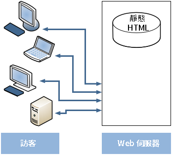

# Dispatcher 總覽 {#dispatcher-overview}

>[!NOTE]
>
>Dispatcher 版本與 AEM 無關。如果您依循了內嵌到舊版 AEM 文件中的 Dispatcher 文件的連結，您可能會被重新導向至本頁。

Dispatcher是Adobe Experience Manager的快取和負載平衡工具，與企業級Web伺服器搭配使用。

部署Dispatcher的程式與所選的Web伺服器和作業系統平台無關：

1. 了解 Dispatcher (本頁)。 另請參閱 [關於Dispatcher的常見問題集](https://experienceleague.adobe.com/docs/experience-manager-dispatcher/using/troubleshooting/dispatcher-faq.html?lang=en).
1. 根據網頁伺服器文件安裝[支援的網頁伺服器](https://experienceleague.adobe.com/docs/experience-manager-65/deploying/introduction/technical-requirements.html?lang=zh-Hant)。
1. [在網頁伺服器上安裝 Dispatcher 模組](dispatcher-install.md)，並相應地設定網頁伺服器。
1. [設定 Dispatcher](dispatcher-configuration.md) (dispatcher.any 檔案)。
1. [設定 AEM](page-invalidate.md)，如此一來內容更新即可讓快取失效。

>[!NOTE]
>
>若要更了解 Dispatcher 如何搭配 AEM 使用：
>
>* 請觀看 [2017 年 7 月的向 AEM 社群專家詢問](https://communities.adobeconnect.com/pf0gem7igw1f/)。
>* 存取[此存放庫](https://github.com/adobe/aem-dispatcher-experiments)。 其中包含一系列「帶回家」實驗室格式的實驗。


視需要使用下列資訊：

* [Dispatcher 安全性檢查清單](security-checklist.md)
* [Dispatcher 知識庫](https://helpx.adobe.com/experience-manager/kb/index/dispatcher.html)
* [將網站快取效能最佳化](https://experienceleague.adobe.com/docs/experience-manager-64/deploying/configuring/configuring-performance.html?lang=en)
* [在多個網域中使用 Dispatcher](dispatcher-domains.md)
* [搭配 Dispatcher 使用 SSL](dispatcher-ssl.md)
* [實作權限敏感型快取](permissions-cache.md)
* [Dispatcher 疑難排解](dispatcher-troubleshooting.md)
* [Dispatcher 熱門問題常見問題集](dispatcher-faq.md)

>[!NOTE]
>
>**Dispatcher 最常見的用法是快取來自 AEM** Publish 執行個體的回應&#x200B;****，以提高您對外發佈網站的回應速度與安全性。大多數的討論均強調此用途。
>
>但是，Dispatcher 也可用來提高您&#x200B;**編寫執行個體**&#x200B;的回應速度，尤其是如果您有大量使用者編輯和更新您的網站時特別實用。如需此情況特有的詳細資訊，請參閱下方的[搭配撰寫伺服器使用 Dispatcher](#using-a-dispatcher-with-an-author-server)。

## 為何要使用 Dispatcher 實作快取？ {#why-use-dispatcher-to-implement-caching}

網路出版的基本方式有兩種:

* **靜態Web伺服器**:例如Apache或IIS，簡單但快速。
* **內部管理伺服器**：提供動態且即時的智慧型內容，但是需要較多的運算時間和其他資源。

Dispatcher 有助於實現快速和動態的環境。這可當成是靜態 HTML 伺服器 (例如 Apache) 的一部分，但其目的是：

* 以靜態網站的形式，盡可能儲存 (或「快取」) 網站內容
* 儘可能減少存取版面引擎。

這表示:

* **靜態內容** 以與靜態Web伺服器相同的速度和簡便方式處理。 此外，您還可以使用可用於靜態Web伺服器的管理和安全工具。

* **動態內容**&#x200B;會視需要產生，除非絕對需要，否則並不會讓系統變慢。

Dispatcher 包含的機制可根據動態網站上的內容來產生和更新靜態的 HTML。您可以詳細指定要將哪些文件儲存為靜態檔案，哪些一律動態產生。

本節說明此程式背後的原則。

### 靜態網頁伺服器 {#static-web-server}



靜態網頁伺服器 (例如 Apache 或 IIS) 會為網站的訪客提供靜態 HTML 檔案。靜態頁面只需建立一次，就能為每個請求傳送相同的內容。

該過程簡單而有效。 如果訪客要求檔案，例如HTML頁面，則會直接從記憶體擷取檔案；最壞的情況是從本地驅動器讀取。 靜態Web伺服器已有相當長的一段時間可用，因此有多種管理和安全管理工具，並且它們與網路基礎架構完全整合。

### 內容管理伺服器 {#content-management-servers}


如果您使用CMS（內容管理伺服器）(例如AEM)，進階配置引擎會處理訪客的請求。 引擎會從存放庫讀取內容，並結合樣式、格式和存取權限，將內容轉換為符合訪客需求和權限的檔案。

此工作流程可讓您建立更豐富的動態內容，進而提高網站的彈性和功能。 不過，版面引擎比靜態伺服器需要更強大的處理能力，因此，如果有許多訪客使用系統，此設定可能會讓速度緩慢。

## Dispatcher 如何執行快取 {#how-dispatcher-performs-caching}


**快取目錄**&#x200B;針對快取，Dispatcher 模組會使用網頁伺服器的功能提供靜態內容。Dispatcher 會將快取的文件置於網頁伺服器的主目錄。

>[!NOTE]
>
>當缺少 HTTP 標題快取的設定時，Dispatcher 只會儲存頁面的 HTML 程式碼，不會儲存 HTTP 標 題。如果您的網站使用不同的編碼，則可能會發生此情況，因為這些頁面可能會遺失。 如要啟用 HTTP 標題快取，請參閱[設定 Dispatcher 快取。](https://experienceleague.adobe.com/docs/experience-manager-dispatcher/using/configuring/dispatcher-configuration.html?lang=en)

>[!NOTE]
>
>在網路連接儲存裝置 (NAS) 上尋找網頁伺服器的主目錄會導致效能降低。另外，當NAS上的文檔根在多個Web伺服器之間共用時，執行複製操作時可能會發生間歇性鎖定。

>[!NOTE]
>
>Dispatcher 將快取的文件以與請求的 URL 相同的結構儲存。
>
>檔案名稱的長度可能有作業系統層級的限制。 也就是說，如果您的URL有許多選取器。

### 快取方法

Dispatcher 有兩種主要方法，用於在對網站進行更改時更新快取內容。

* **內容更新** 移除已變更的頁面，以及與其直接相關聯的檔案。
* **自動失效**&#x200B;功能會自動讓那些在更新後可能過期的快取失效。也就是說，它會將相關頁面有效標示為過時，而不會刪除任何項目。

### 內容更新

每次內容更新會變更一或多個 AEM 文件。AEM 會傳送整合請求給 Dispatcher，Dispatcher 會隨之更新快取:

1. 它會從快取中刪除修改的檔案。
1. 它會從快取中刪除以相同名稱開頭的所有檔案。例如如果 file /en/index.html 已更新，則所有以 /en/index 開頭的檔案都會遭到刪除。此機制可讓您設計快取效率高的網站，尤其是圖片導覽。
1. It *接觸* 所謂 **statfile**，會更新statfile的時間戳記，以指出上次變更的日期。

請注意下列幾點:

* 內容更新通常與製作系統搭配使用，而製作系統「知道」必須取代的內容。
* 受內容更新影響的檔案會遭到移除，但不會立即替換。下次請求此類檔案時，Dispatcher會從AEM例項擷取新檔案，並將其置於快取中，以覆寫舊內容。
* 通常，包含頁面文字的自動產生圖片，會儲存在開頭為相同名稱的圖片檔案中，因而可確保要刪除的檔案的關聯性存在。例如您可以將頁面 mypage.html 的標題文字儲存為相同檔案夾中名稱為 mypage.titlePicture.gif 的圖片。如此一來，每次更新頁面時，圖片都會自動從快取中刪除，因此您可以確定圖片會一律反映頁面的最新版本。
* 您可能有數個 statfile，例如每個語言檔案夾一個。如果頁面已更新，AEM 會尋找下一個包含 statfile 的上層檔案夾，並&#x200B;*接觸*&#x200B;該檔案。

### 自動失效

自動失效功能會自動讓部分的快取失效，而不會實際刪除任何檔案。在每次內容更新時，都會接觸到所謂的 statfile，因此其時間戳記都會顯示最後一次的內容更新。

Dispatcher 有一個檔案清單，這些檔案會自動失效。請求該清單中的文件時，Dispatcher 會將快取文件的日期與 statfile 的時間戳相比較:

* 如果快取的文件較新，則 Dispatcher 會傳回快取的文件。
* 如果快取的文件版本較舊，則 Dispatcher 會從 AEM 執行個體擷取最新版本。

同樣請您注意下列幾點：

* 當內部關係複雜(例如HTML頁面)時，通常會使用自動失效。 這些頁面包含連結和導覽項目，因此通常必須在內容更新後加以更新。如果您已自動產生PDF或圖片檔案，您也可以選擇自動使這些檔案無效。
* 除了接觸到statfile外，自動失效不涉及Dispatcher在更新時執行的任何動作。 不過，觸及 statfile 會自動使快取內容逾時，而不會從快取中實際刪除檔案。

## Dispatcher 如何傳回文件 {#how-dispatcher-returns-documents}


### 判斷文件是否受限於快取

您可以[定義 Dispatcher 會在設定檔案中快取哪些文件](https://experienceleague.adobe.com/docs/experience-manager-dispatcher/using/configuring/dispatcher-configuration.html?lang=en)。 Dispatcher 會根據可快取文件清單來檢查請求。如果文件不在此清單中，Dispatcher 會請求 AEM 執行個體的文件。

在下列情況下，Dispatcher 一律會直接從 AEM 執行個體要求文件:

* 請求URI包含問號「`?`」。 此案例通常表示動態頁面（例如搜尋結果）不需要快取。
* 缺少副檔名。 網頁伺服器需要副檔名來判斷文件類型 (MIME 類型)。
* 驗證標頭已設定（可設定）。

>[!NOTE]
>
>Dispatcher 可快取 GET 或 HEAD (用於 HTTP 標題) 方法。如需有關回應標題快取的其他資訊，請參閱[快取 HTTP 回應標題](https://experienceleague.adobe.com/docs/experience-manager-dispatcher/using/configuring/dispatcher-configuration.html?lang=en)一節。

### 確定是否已快取文件

Dispatcher 會將快取的檔案儲存在網頁伺服器上，就像是靜態網站的一部分一樣。如果使用者要求可快取的檔案，Dispatcher會檢查該檔案是否存在於Web伺服器的檔案系統中：

* 如果已快取該文件，則 Dispatcher 會將檔案傳回。
* 如果未快取，則 Dispatcher 會從 AEM 執行個體要求該文件。

### 確定文件是否為最新版本

為了要瞭解文件是否為最新版本，Dispatcher 會執行下列兩個步驟:

1. 它會檢查文件是否會自動失效。如果不會，則將該文件視為最新版本。
1. 如果文件已設定為會自動失效，Dispatcher 會檢查其是否比最後一次可用變更來得舊或更新。如果版本較舊，Dispatcher 會請求來自 AEM 執行個體的最新版本，並取代快取中的版本。

>[!NOTE]
>
>不含 **自動失效** 保留在快取中，直到實際刪除為止。 例如，透過網站上的內容更新。

## 負載平衡的優點 {#the-benefits-of-load-balancing}

「負載平衡」是將網站的運算負載分配至數個 AEM 執行個體的作法。


其優點如下: 

* **增加處理能力**
實際上，提高處理能力表示Dispatcher會與多個AEM例項共用檔案請求。 由於每個執行個體現在要處理的文件數量較少，因此您的回應時間就會變快。Dispatcher 會保留每個文件類別的內部統計資料，以便能夠估計負載並有效率地分配查詢。

* **增加故障保護覆蓋**
如果Dispatcher未收到來自例項的回應，則會自動將要求中繼至其他例項。 如果例項無法使用，唯一的效果是網站速度變慢，與失去的運算能力成正比。 但是，所有服務都繼續。

* 您也可以在相同的靜態Web伺服器上管理不同的網站。

>[!NOTE]
>
>雖然負載平衡可以有效率地分散負載，但快取可有助於降低負載。因此，在設定負載平衡之前，請嘗試最佳化快取並降低整體的負載。良好的快取可以提高負載平衡器的效能，或不需要進行負載平衡。

>[!CAUTION]
>
>雖然單一Dispatcher可讓可用的Publish例項的容量達到飽和，但對於某些罕見的應用程式而言，平衡兩個Dispatcher例項之間的負載也是可行的。 設定多個Dispatcher時必須謹慎考慮，因為額外的Dispatcher可增加可用Publish例項的負載，且可輕鬆降低大部分應用程式的效能。

## Dispatcher 如何執行負載平衡 {#how-the-dispatcher-performs-load-balancing}

### 效能統計資料

Dispatcher 會保留內部統計資料，瞭解 AEM 每個執行個體處理檔案的速度。Dispatcher會根據此資料來估計哪個例項在回應請求時可提供最快的回應時間，因此會保留該例項所需的計算時間。

不同類型的請求可能具有不同的平均完成時間，因此Dispatcher可讓您指定檔案類別。 然後在計算時間估計時考慮這些類別。 例如，您可以區分HTML頁面和影像，因為一般的回應時間可能不同。

如果您使用複雜的搜尋功能，則可建立搜尋查詢的類別。 此方法可協助Dispatcher將搜尋查詢傳送至回應最快的例項。 這也有助於防止速度較慢的例項收到數個「昂貴」的搜尋查詢時停頓下來，而其他例項收到「較便宜」的請求。

### 個人化內容 (黏著連線)

黏著連線可確保同一個使用者的文件都是在 AEM 的同一個執行個體上撰寫。如果您使用個人化頁面和工作階段資料，此點就很重要。 資料會儲存在同一執行個體上，因此來自相同使用者的後續請求都必須傳回給該執行個體，否則資料會遺失。

由於黏著連線會限制 Dispatcher 最佳化請求的功能，因此您應該視需要來使用。您可以指定包含「黏著」文件的檔案夾，如此可確保該檔案夾中的所有文件都是針對每位使用者在相同執行個體上所撰寫。

>[!NOTE]
>
>針對使用黏著連線的大部分頁面，您必須關閉快取功能，否則無論工作階段內容為何，對所有使用者而言頁面看起來都一樣。
>
>對於&#x200B;*少數*&#x200B;應用程式而言，可以同時使用黏著連線和快取；例如如果顯示將資料寫入工作階段的表單。

## 使用多個 Dispatcher {#using-multiple-dispatchers}

您可以透過複雜的設定來使用多個 Dispatcher。例如您可以使用：

* 一個 Dispatcher 在內部網路上發佈網站
* 另一個 Dispatcher 位於不同的位址下，並具有不同的安全設定，以便在網際網路上發佈相同的內容。

在這種情況下，請確定每個請求只通過一個 Dispatcher。Dispatcher 不會處理來自其他 Dispatcher 的請求。因此，請確定兩個 Dispatcher 都直接存取 AEM 網站。

## 搭配 CDN 使用 Dispatcher {#using-dispatcher-with-a-cdn}

內容傳遞網路 (CDN) (例如 Akamai Edge Delivery 或 Amazon Cloud Front) 會從接近使用者的位置傳遞內容。藉此可

* 加速使用者的回應時間
* 卸除伺服器的負載

CDN是HTTP基礎架構元件，其運作方式與Dispatcher類似。當CDN節點收到請求時，會盡可能從其快取中提供請求（該資源可在快取中使用且有效）。 否則，會前往下一個最近的伺服器，為進一步的請求擷取資源並加以快取 (如適用)。

「下一個最近的伺服器」要取決於您的特定設定。例如在 Akamai 設定中，請求可採取下列路徑:

* Akamai Edge 節點
* Akamai Midgres 層
* 防火牆
* 您的負載平衡器
* Dispatcher
* AEM

通常，Dispatcher是下一個伺服器，可從快取中提供檔案，並影響傳回至CDN伺服器的回應標題。

## 控制 CDN 快取 {#controlling-a-cdn-cache}

CDN從Dispatcher重新擷取資源前，有數種方法可控制CDN快取資源的時間長度。

1. 明確設定\
   視MIME類型、副檔名、請求類型等，設定CDN快取中保留特定資源的時間。

1. 到期日和快取控制標題\
   大部分的CDN都享有 `Expires:` 和 `Cache-Control:` HTTP標題（若是由上游伺服器傳送）。 例如，可使用 [mod_expires](https://httpd.apache.org/docs/2.4/mod/mod_expires.html) Apache模組。

1. 手動失效\
   CDN 可透過 Web 介面從快取中移除資源。
1. API型失效\
   大部分的 CDN 也提供 REST 和/或 SOAP API，可從快取中移除資源。

在一般的AEM設定中，依擴充功能、依路徑或兩者進行設定（可透過上述第1和2點達成），可讓您為經常使用的資源（例如設計影像和用戶端程式庫）設定合理的快取期間，而這些資源不會經常變更。 部署新版本時，通常需要手動失效。

如果將此方法用於快取受管理的內容，則表示只有在已設定的快取期限到期，並且已再次從 Dispatcher 中擷取文件後，使用者才能看到內容變更。

為了達到更精細的控制，API型的失效可讓您在Dispatcher快取失效時，使CDN的快取失效。 您可以根據CDN API來實作自己的 [ContentBuilder](https://developer.adobe.com/experience-manager/reference-materials/6-5/javadoc/com/day/cq/replication/ContentBuilder.html) 和 [傳輸處理程式](https://developer.adobe.com/experience-manager/reference-materials/6-5/javadoc/com/day/cq/replication/TransportHandler.html) （如果API不是REST型），請設定復寫代理程式，使用這些片段來使CDN的快取失效。

>[!NOTE]
>
>另請參閱 [AEM (CQ) Dispatcher 安全性和 CDN+瀏覽器快取](https://www.slideshare.net/andrewmkhoury/dispatcher-caching-aemgemspart2jan2015)，以及關於 [Dispatcher 快取](https://experienceleague.adobe.com/docs/experience-manager-gems-events/gems/gems2015/aem-dispatcher-caching-new-features-and-optimizations.html?lang=en)的相關錄製簡報。

## 搭配撰寫伺服器使用 Dispatcher {#using-a-dispatcher-with-an-author-server}

>[!CAUTION]
>
>如果您使用 [AEM搭配Touch UI](https://experienceleague.adobe.com/docs/experience-manager-65/developing/introduction/touch-ui-concepts.html?lang=en), do **not** 快取製作例項內容。 如果已為Author例項啟用快取，則必須停用快取並刪除快取目錄的內容。 若要停用快取，請編輯 `author_dispatcher.any` 檔案，並修改 `/rule` 屬性 `/cache` 區段如下：

```xml
/rules
{
/0000
{ /type "deny" /glob "*"}
}
```

Dispatcher 可用於編寫執行個體之前，以改善編寫效能。如要設定編寫 Dispatcher，請執行以下操作: 

1. 在Web伺服器(Apache或IIS web伺服器，請參閱 [安裝Dispatcher](dispatcher-install.md))。
1. 根據正在運作的AEM發佈例項，測試新安裝的Dispatcher。 這樣可確保完成基準正確的安裝。
1. 現在，請確定 Dispatcher 能夠透過 TCP/IP 連接到您的編寫執行個體。
1. 取代範例 `dispatcher.any` 檔案 `author_dispatcher.any` 隨提供的檔案 [Dispatcher下載](release-notes.md#downloads).
1. 在文字編輯器中開啟 `author_dispatcher.any`，並進行下列變更: 

   1. 變更 `/hostname` 和 `/port` 的 `/renders` 區段，以便指向您的author例項。
   1. 變更 `/docroot` 的 `/cache` 區段，以便指向快取目錄。 如果您正在使用[具有 Touch UI 的 AEM](https://experienceleague.adobe.com/docs/experience-manager-65/developing/introduction/touch-ui-concepts.html?lang=en)，請參閱上面的警告。
   1. 儲存變更。

1. 刪除您在上面設定的 `/cache` > `/docroot` 目錄中的所有現有檔案。
1. 重新啟動網頁伺服器。

>[!NOTE]
>
>已提供 `author_dispatcher.any` 設定時，若您安裝的CQ5功能套件、Hotfix或應用程式程式碼套件會影響 `/libs` 或 `/apps`，您必須刪除Dispatcher快取中這些目錄下的快取檔案。 這樣可確保下次請求時，將會擷取新升級的檔案，而非舊的快取檔案。

>[!CAUTION]
>
>如果您已使用先前設定的Author Dispatcher並啟用 *調度程式排清代理*，請執行下列動作：

1. 刪除或停用 **作者的** 正在排清AEM製作例項上的代理程式。
1. 請依照上述新指示，重做製作Dispatcher設定。

<!--
[Author Dispatcher configuration file (Dispatcher 4.1.2 or later)](assets/author_dispatchernew.any)
-->
<!--[!NOTE]
>
>A related knowledge base article can be found here:  
>[How to configure the dispatcher in front of an authoring environment](https://helpx.adobe.com/cq/kb/HowToConfigureDispatcherForAuthoringEnvironment.html)
-->
