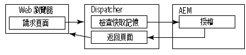
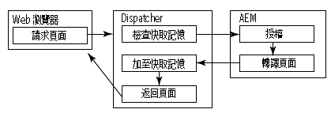
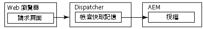

# 快取安全內容 {#caching-secured-content}

權限相關快取可讓您快取受保護的頁面。 Dispatcher會在傳送快取頁面之前，先檢查使用者對頁面的存取權限。

Dispatcher包含AuthChecker模組，可實作權限感應快取。 當模組啟動時，轉譯會呼叫AEM servlet，以針對所要求的內容執行使用者驗證和授權。 Servlet響應確定內容是否被傳送到Web瀏覽器。

由於驗證和授權方法是AEM部署專屬的，因此您必須建立servlet。

>[!NOTE]
>
>使用`deny`篩選器來強制實施一攬子安全限制。 對設定為允許存取使用者或群組子集的頁面使用權限相關快取。

下圖說明當網頁瀏覽器要求使用權限相關快取的頁面時，發生事件的順序。

## 頁面已快取，使用者已獲得{#page-is-cached-and-user-is-authorized}授權



1. Dispatcher會判斷請求的內容已快取且有效。
1. Dispatcher會傳送請求訊息至演算。 HEAD區段包含瀏覽器請求中的所有題頭行。
1. 演算器會呼叫授權者以執行安全性檢查並回應Dispatcher。 回應訊息包含200的HTTP狀態碼，以指出使用者已獲得授權。
1. Dispatcher會傳送回應訊息給瀏覽器，該回應訊息包含來自演算回應的標題行和內文中快取的內容。

## 頁面未快取，且使用者已獲得{#page-is-not-cached-and-user-is-authorized}授權



1. Dispatcher確定內容未快取或需要更新。
1. Dispatcher會將原始請求轉送至演算。
1. 轉換器調用授權者servlet以執行安全檢查。 當用戶被授權時，渲染器將渲染的頁面包括在響應消息的正文中。
1. Dispatcher將響應轉發到瀏覽器。 Dispatcher將Render的響應消息的正文添加到快取中。

## 用戶未獲得{#user-is-not-authorized}授權



1. Dispatcher會檢查快取。
1. Dispatcher會傳送請求訊息給演算器，其中包含瀏覽器請求中的所有標題行。
1. render調用authorizer servlet執行失敗的安全檢查，render將原始請求轉發到Dispatcher。

## 實作權限相關快取{#implementing-permission-sensitive-caching}

若要實作權限相關快取，請執行下列工作：

* 開發執行驗證和授權的Servlet
* 配置Dispatcher

>[!NOTE]
>
>通常，安全資源會儲存在不安全檔案以外的個別資料夾中。 例如，/content/secure/


## 建立授權servlet {#create-the-authorization-servlet}

建立和部署Servlet，該Servlet執行請求Web內容的用戶的驗證和授權。 Servlet可以使用任何驗證和授權方法，例如AEM使用者帳戶和儲存庫ACL，或LDAP查閱服務。 您可將servlet部署至Dispatcher用作演算的AEM例項。

所有用戶都必須可以訪問Servlet。 因此，Servlet應該擴展`org.apache.sling.api.servlets.SlingSafeMethodsServlet`類，該類提供對系統的只讀訪問。

Servlet僅接收來自render的HEAD請求，因此您只需實施`doHead`方法。

演算包含所請求資源的URI作為HTTP請求的參數。 例如，通過`/bin/permissioncheck`訪問授權servlet。 若要在/content/geometrixx-outdoors/en.html頁面上執行安全性檢查，轉譯會在HTTP要求中包含下列URL:

`/bin/permissioncheck?uri=/content/geometrixx-outdoors/en.html`

Servlet響應消息必須包含以下HTTP狀態代碼：

* 200:已傳遞驗證和授權。

以下示例servlet從HTTP請求中獲取所請求資源的URL。 代碼使用Felix SCR `Property`注釋將`sling.servlet.paths`屬性的值設定為/bin/permissioncheck。 在`doHead`方法中，servlet獲取會話對象，並使用`checkPermission`方法確定相應的響應代碼。

>[!NOTE]
>
>sling.servlet.paths屬性的值必須在Sling Servlet Resolver(org.apache.sling.servlets.resolver.SlingServletResolver)服務中啟用。

### Servlet {#example-servlet}示例

```java
package com.adobe.example;

import org.apache.felix.scr.annotations.Component;
import org.apache.felix.scr.annotations.Service;
import org.apache.felix.scr.annotations.Property;

import org.apache.sling.api.SlingHttpServletRequest;
import org.apache.sling.api.SlingHttpServletResponse;
import org.apache.sling.api.servlets.SlingSafeMethodsServlet;

import org.slf4j.Logger;
import org.slf4j.LoggerFactory;

import javax.jcr.Session;

@Component(metatype=false)
@Service
public class AuthcheckerServlet extends SlingSafeMethodsServlet {
 
    @Property(value="/bin/permissioncheck")
    static final String SERVLET_PATH="sling.servlet.paths";
    
    private Logger logger = LoggerFactory.getLogger(this.getClass());
    
    public void doHead(SlingHttpServletRequest request, SlingHttpServletResponse response) {
     try{ 
      //retrieve the requested URL
      String uri = request.getParameter("uri");
      //obtain the session from the request
      Session session = request.getResourceResolver().adaptTo(javax.jcr.Session.class);     
      //perform the permissions check
      try {
       session.checkPermission(uri, Session.ACTION_READ);
       logger.info("authchecker says OK");
       response.setStatus(SlingHttpServletResponse.SC_OK);
      } catch(Exception e) {
       logger.info("authchecker says READ access DENIED!");
       response.setStatus(SlingHttpServletResponse.SC_FORBIDDEN);
      }
     }catch(Exception e){
      logger.error("authchecker servlet exception: " + e.getMessage());
     }
    }
}
```

## 配置Dispatcher以獲得對權限敏感的快取{#configure-dispatcher-for-permission-sensitive-caching}

dispatcher.any檔案的auth_checker區段會控制權限相關快取的行為。 auth_checker區段包含下列子區段：

* `url`:執行安全檢 `sling.servlet.paths` 查的servlet屬性的值。

* `filter`:指定套用權限相關快取的資料夾的篩選器。通常，`deny`篩選器會套用至所有資料夾，而`allow`篩選器則會套用至受保護的資料夾。

* `headers`:指定授權servlet在響應中包含的HTTP標頭。

Dispatcher啟動時，Dispatcher日誌檔案包含以下調試級別消息：

`AuthChecker: initialized with URL 'configured_url'.`

下面的示例auth_checker部分將Dispatcher配置為使用前置主題的servlet。 篩選區段只會在安全的HTML資源上執行權限檢查。

### 配置示例{#example-configuration}

```xml
/auth_checker
  {
  # request is sent to this URL with '?uri=<page>' appended
  /url "/bin/permissioncheck"
      
  # only the requested pages matching the filter section below are checked,
  # all other pages get delivered unchecked
  /filter
    {
    /0000
      {
      /glob "*"
      /type "deny"
      }
    /0001
      {
      /glob "/content/secure/*.html"
      /type "allow"
      }
    }
  # any header line returned from the auth_checker's HEAD request matching
  # the section below will be returned as well
  /headers
    {
    /0000
      {
      /glob "*"
      /type "deny"
      }
    /0001
      {
      /glob "Set-Cookie:*"
      /type "allow"
      }
    }
  }
```

